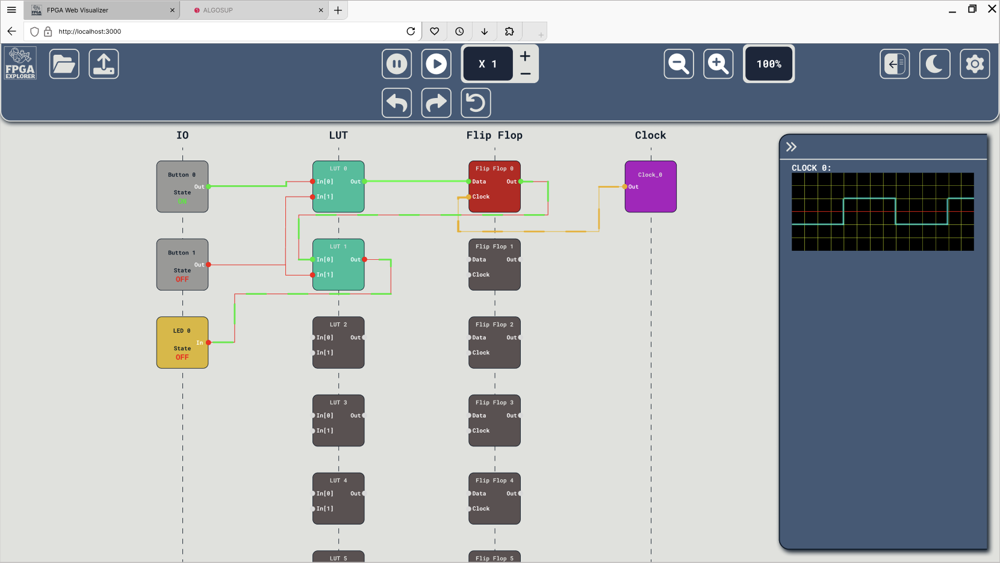

# Functional Specifications

---
**Title:** FPGA Explorer - Team 4

**Author:** Maxime CARON

**Team:** Team 4

**Reviewer:** Guillaume Despaux

**Created on:** February 25th, 2025

**Last updated:** March 10th, 2025

---

 

<h2 id="toc"> Table of Contents <i>(Click to expand)</i></h2>

- [Functional Specifications](#functional-specifications)
  - [Preamble](#preamble)
  - [Introduction](#introduction)
    - [Glossary](#glossary)
    - [Project Overview](#project-overview)
    - [Project Definition](#project-definition)
      - [Vision](#vision)
      - [State of the Art](#state-of-the-art)
      - [Scope](#scope)
      - [Deliverables](#deliverables)
    - [Project Organization|](#project-organization)
      - [Project Representatives](#project-representatives)
      - [Team and Roles](#team-and-roles)
      - [Stakeholders](#stakeholders)
      - [Project Reviewers](#project-reviewers)
    - [Project Timeline](#project-timeline)
      - [Retro-Planning](#retro-planning)
      - [Milestones](#milestones)
      - [Resources](#resources)
      - [Assumptions and Constraints](#assumptions-and-constraints)
  - [Personas](#personas)
    - [Use Cases List](#use-cases-list)
    - [Use Case Descriptions](#use-case-descriptions)
  - [UI/UX](#uiux)
    - [Inspiration](#inspiration)
    - [Wireframes](#wireframes)
      - [Main Page](#main-page)
      - [Settings Modal](#settings-modal)
      - [Information Messages](#information-messages)
    - [Mockups](#mockups)
      - [Light Mode](#light-mode)
        - [Main Page](#main-page-1)
        - [Settings Modal](#settings-modal-1)
        - [Information Messages](#information-messages-1)
      - [Dark Mode](#dark-mode)
        - [Main Page](#main-page-2)
        - [Settings Modal](#settings-modal-2)
        - [Information Messages](#information-messages-2)
    - [Logo](#logo)
  - [Functional Requirements](#functional-requirements)
    - [SDF File Upload](#sdf-file-upload)
    - [Real-Time Clock Speed Adjustment](#real-time-clock-speed-adjustment)
    - [Simulation Control](#simulation-control)
    - [Simulation Control Step-by-Step](#simulation-control-step-by-step)
    - [Real-Time Interactions](#real-time-interactions)
    - [Zoom Features](#zoom-features)
    - [Light and Dark Mode](#light-and-dark-mode)
  - [Non-Functional Requirements](#non-functional-requirements)
    - [Performance](#performance)
    - [Hosting Performance](#hosting-performance)
    - [Ease of Use](#ease-of-use)
    - [Compatibility](#compatibility)
  - [Future Improvements](#future-improvements)
  - [Legal and Compliance](#legal-and-compliance)
    - [Data Protection and Privacy](#data-protection-and-privacy)
    - [Accessibility](#accessibility)
    - [Security](#security)
    - [Intellectual Property](#intellectual-property)
  - [End Matter](#end-matter)
    - [Contributors](#contributors)
    - [License](#license)

---

## Preamble
*This document outlines the functional specifications for the development of a web interface designed to simulate the internal chip flows of an FPGA. This document serves as a comprehensive guide for the project's scope, requirements, and objectives, ensuring that all stakeholders have a clear understanding of the project's goals and deliverables.*

---
## Introduction

### Glossary

### Project Overview
This project aims to develop a user-friendly web interface for simulating the internal chip flows of an FPGA. This interface will enable teachers and students to easily upload SDF files, adjust real-time clock speeds, and view simulation results. By streamlining the simulation process, this tool will enhance the educational experience and provide a practical demonstration of FPGA behavior in classroom settings.

### Project Definition

#### Vision
The vision of this project is to provide an open-source educational web platform for learning FPGA internal functioning and exploring the challenges associated with this technology.

Team objectives include:
- Developing a user-friendly web interface for simulating FPGA internal chip flows.
- Providing tools for uploading SDF files, adjusting clock speeds, and controlling simulations.
- Enhancing the educational experience for students and teachers through interactive real-time demonstrations.
- Ensuring the interface’s visual design is optimized for computer screens and video projectors.

#### State of the Art
Currently, there is no dedicated web interface for FPGA internal chip flow simulation. Existing solutions rely on expensive, complex software that is not tailored for educational use. These tools often have steep learning curves and are not designed for interactive real-time demonstrations. This project aims to fill that gap by offering a simple, accessible, and cost-effective solution.

Existing simulation tools:
| Tool | Licence type | Limitations | Price | Source |
| ---- | ------------ | ----------- | ----- | ------ |
| Xilinx Vivado | Vivado ML Enterprise Edition, Fixed license, NCNR | Complex interface, expensive, not educational | $4,395| [🔗](https://www.amd.com/en/products/software/adaptive-socs-and-fpgas/vivado/vivado-buy.html#) |
| Intel Quartus Prime | Quartus Prime Pro Edition, Fixed license | Complex interface, expensive, not educational | $3,995  | [🔗](https://www.thailand.intel.com/content/dam/www/central-libraries/us/en/documents/quartus-prime-compare-editions-guide.pdf) |
| Intel Quartus Prime | Quartus Prime Standard Edition, Fixed license | Complex interface, expensive, not educational | $2,995  | [🔗](https://www.thailand.intel.com/content/dam/www/central-libraries/us/en/documents/quartus-prime-compare-editions-guide.pdf) |
| Intel Quartus Prime | Quartus Prime Lite Edition | Complex interface, not educational, missing some simulation tools | Free  | [🔗](https://www.thailand.intel.com/content/dam/www/central-libraries/us/en/documents/quartus-prime-compare-editions-guide.pdf) |

#### Scope
This project will use the following technologies:
Frontend: Native JavaScript, HTML, CSS
Backend: Node.js with Express.js (subject to change based on project needs)

The final product will consist of a local server hosting a web interface accessible from any modern web browser.

#### Deliverables
| Deliverable | Purpose | Document |
| ----------- | ------- | ---- |
| Functional Specifications | Define project scope and requirements | [🔗](./functional-specifications.md) |
| Graphic Charter | Define the visual identity of the web interface | [🔗](./graphic-charter.md) |
| Technical Specifications | Outline technical details and implementation plan | [🔗](./../technical-specifications/technical-specifications.md) |
| Test Plan | Define testing procedures and criteria | [🔗](./../quality-assurance/test-plan.md) |
| User Manual | Provide instructions for using the web interface | [🔗](./../user-manual/user-manual.md) |
| Source Code | Share the project codebase with the community | [🔗](./../../src) |

### Project Organization|

#### Project Representatives
| Owners | Representative |
| ------ | -------------- |
| [CNES](https://www.cnes.fr/en) | Represented by [Florent MANNI](https://www.linkedin.com/in/florent-manni-182547211/) |
| [ALGOSUP](https://www.algosup.com) | Represented by [Franck JEANNIN](https://www.linkedin.com/in/franck-jeannin/) |
| [Thibaud MARLIER](https://www.linkedin.com/in/thibaudmarlier/) | Represented by [Maxime CARON](https://www.linkedin.com/in/maxime-caron-dev/) (Program Manager)|

#### Team and Roles

| Full Name | Role | Role Description | Contact |
| --------- | ---- | ---------------- | ------- |
| Thibaud MARLIER | Project Manager | Responsible for project planning, coordination, and communication | [LinkedIn](https://www.linkedin.com/in/thibaudmarlier/) |
| Maxime CARON | Program Manager | Ensures project meets expectations; oversees design and functional specs | [LinkedIn](https://www.linkedin.com/in/maxime-caron-dev/) |
| Emilien CHINSY | Technical Lead | Oversees technical aspects, including architecture and implementation | [LinkedIn](https://www.linkedin.com/in/emilien-chinsy-5a794632b/) |
| Guillaume DESPAUX | Quality Assurance | Ensures quality of deliverables and adherence to requirements | [LinkedIn](https://www.linkedin.com/in/guillaume-despaux/) |
| Clementine CUREL | Technical Writer | Documents the project, including user manuals	 | [LinkedIn](https://www.linkedin.com/in/clementinecurel/) |
| Jason GROSSO | Software Engineer | Develops the web interface and simulation engine | [LinkedIn](https://www.linkedin.com/in/jason-grosso-847b39251/) |
| Lauren BOUQUIN | Software Engineer | Develops the web interface and simulation engine | [LinkedIn](https://www.linkedin.com/in/laurentb22/) |

#### Stakeholders

| Stakeholder | Interest |
| ----------- | -------- |
| CNES | Project initiator and primary beneficiary |
| ALGOSUP | Project collaborator and technology provider |
| ALGOSUP Students| Developers and testers of the project |
| Teachers | End users of the web interface for educational purposes |
| Students | End users of the web interface for learning FPGA concepts |

#### Project Reviewers
External project reviewers have been appointed by the project owner to review our specifications and provide us with feedback.

### Project Timeline

#### Retro-Planning

The project will be developed in 6 weeks, from 24th February 2025 to 4th April 2025.

#### Milestones
| Date       | Milestone                 | Responsible                  |
| ---------- | ------------------------- | ---------------------------- |
| 02/28/2025 | First Weekly Report       | Thibaud MARLIER              |
| 03/07/2025 | Second Weekly Report      | Thibaud MARLIER              |
| 03/13/2025 | Functional Specifications | Maxime CARON                 |
| 03/13/2025 | Graphic Charter           | Maxime CARON                 |
| 03/14/2025 | Third Weekly Report       | Thibaud MARLIER              |
| 03/21/2025 | Fourth Weekly Report      | Thibaud MARLIER              |
| 03/25/2025 | Technical Specifications  | Emilien CHINSY               |
| 03/25/2025 | Test Plan                 | Guillaume DESPAUX            |
| 03/28/2025 | Fifth Weekly Report       | Thibaud MARLIER              |
| 04/01/2025 | User Manual               | Clementine CUREL             |
| 04/01/2025 | Source Code               | Jason GROSS & Lauren BOUQUIN |
| 04/04/2025 | Final Presentation        | Entire Team                  |
| 04/04/2025 | Final Report              | Thibaud MARLIER              |
| 04/04/2025 | Project Post-Mortem       | Thibaud MARLIER              |

#### Resources
- Team of 7 people
- Input from teachers and professionals at CNES
- Help from ALGOSUP teachers and professionals
- External project reviewers
- Open-source tools and libraries
- SDF file examples
- Estimated project time: 490 hours (10 days × 7 people × 7 hours/day)

#### Assumptions and Constraints
- The project will use web technologies (HTML, CSS, JavaScript, Node.js, Express.js).
- It will be hosted on a local server and accessible via modern web browsers.
- The project is open source and free for educational use.
- It will be developed in English and tested on Chrome, Firefox, Safari, and Edge.
- It will be designed for ease of deployment on local machines with limited resources.
- The interface will accommodate users with varying technical expertise and adhere to accessibility guidelines.
- The project will comply with relevant data protection and privacy regulations.

---
## Personas

**1. Emily Thompson – High School Technology Teacher**  

  
  

    <strong>Background:</strong> A passionate educator who integrates hands-on technology into her curriculum. 
    <strong>Goals:</strong> 
    - To demonstrate complex FPGA concepts through interactive, real-time simulations. 
    - To simplify the learning process with an intuitive, accessible interface. 
    <strong>Frustrations:</strong> 
    - Tools that are too complex or expensive. 
    - Lack of real-time interactivity that limits classroom engagement.
  

 

**2. Mark Reynolds – Undergraduate Electrical Engineering Student** 

  
  

    <strong>Background:</strong> An enthusiastic student eager to learn FPGA design and simulation. 
    <strong>Goals:</strong> 
    - To experiment with different simulation parameters (like clock speeds and step sizes) for deeper understanding. 
    - To use a tool that bridges theoretical concepts with practical application. 
    <strong>Frustrations:</strong> 
    - Limited hands-on opportunities with actual FPGA behavior. 
    - Overly technical interfaces that require steep learning curves.
  

 

**3. Alex Kim – Software Developer & System Administrator** 

  
  

    <strong>Background:</strong> Responsible for maintaining and updating the web interface, ensuring its performance and ease of deployment.. 
    <strong>Goals:</strong> 
    - To provide a reliable, responsive simulation tool that meets both educational and technical requirements.. 
    - To integrate user feedback for continuous improvement. 
    <strong>Frustrations:</strong> 
    - Unresponsive systems or frequent bugs that disrupt classroom sessions. 
    - Complex deployment processes that hinder local installations.
  

---
### Use Cases List

| Use Case ID | Use Case Name                    | Description                                                                               |
| ----------- | -------------------------------- | ----------------------------------------------------------------------------------------- |
| 1           | Upload SDF File                  | Users can upload an SDF file containing the FPGA's internal structure for simulation.      |
| 2           | Adjust Real-Time Clock Speed     | Users can adjust the simulation's clock speed in real-time to observe different chip behaviors. |
| 3           | Control Simulation (Start, Pause, Reset) | Users can start, pause, and reset the simulation to observe specific chip states.         |
| 4           | Step-By-Step Simulation Mode     | Users can advance the simulation step-by-step to analyze internal chip flows in detail.     |
| 5           | Zoom Features                    | Users can zoom in and out of the chip's internal structure to focus on specific areas.     |

---

### Use Case Descriptions

**Use Case 1: Upload SDF File**

| Field           | Description |
|-----------------|-------------|
| **Use Case ID** | 1           |
| **Use Case Name** | Upload SDF File |
| **Actor** | Teacher or Student |
| **Description** | The user navigates to the simulation page and selects the "Upload SDF" option. The system validates the file format and size, then parses and visually renders the FPGA’s internal structure. |
| **Preconditions** | The user is logged in and has access to the simulation interface. |
| **Postconditions** | The SDF file is successfully parsed and its contents are displayed. If validation fails, an error message is shown, and the user is prompted to re-upload a valid file. |
| **Flow** | 1. The user navigates to the simulation page. 2. The user clicks the "Upload SDF" button. 3. The user selects an SDF file from the local device. 4. The system validates file format and size. 5. **Alternate Flow:** If validation fails, the system displays an error message and returns to the upload step. 6. If the file is valid, the system parses the file. 7. The system renders the FPGA's internal structure based on parsed data. |

---

**Use Case 2: Adjust Real-Time Clock Speed**

| Field           | Description |
|-----------------|-------------|
| **Use Case ID** | 2           |
| **Use Case Name** | Adjust Real-Time Clock Speed |
| **Actor** | Teacher or Student |
| **Description** | The user interacts with controls (e.g., `+`/`-` buttons) to adjust the simulation's clock speed within a defined range (e.g., X0.25 to X32). The system immediately updates the simulation to reflect the new speed. |
| **Preconditions** | A simulation is loaded and either running or paused. |
| **Postconditions** | The simulation clock speed is updated accordingly. If an invalid input is detected or the user cancels the operation, the system retains the previous valid setting and displays an appropriate message. |
| **Flow** | 1. The user clicks on the `+` or `-` buttons to change the clock speed. 2. The system checks the input for validity. 3. **Alternate Flow:** If the input is invalid, an error message is displayed and the input is rejected. 4. If valid, the system updates the simulation clock speed immediately. 5. The simulation reflects the new speed in real-time, and a status message confirms the update. |

---

**Use Case 3: Control Simulation (Start, Pause, Reset)**

| Field           | Description |
|-----------------|-------------|
| **Use Case ID** | 3           |
| **Use Case Name** | Control Simulation (Start, Pause, Reset) |
| **Actor** | Teacher or Student |
| **Description** | The user uses dedicated controls to start, pause, or reset the simulation. Visual cues and status indicators inform the user of the current state. |
| **Preconditions** | An SDF file has been successfully uploaded and parsed. |
| **Postconditions** | The simulation transitions to the requested state (running, paused, or reset), and the interface updates to reflect this state. |
| **Flow** | 1. The user clicks the "Start Simulation" button to begin the simulation. 2. Once running, the user may click "Pause" to halt progress or "Reset" to restart the simulation. 3. The system updates the simulation state and displays corresponding status indicators (e.g., "Running", "Paused", "Reset"). 4. **Alternate Flow:** If the user attempts to control the simulation before an SDF file is uploaded, the system prompts the user to complete the file upload first. |

---

**Use Case 4: Step-By-Step Simulation Mode**

| Field           | Description |
|-----------------|-------------|
| **Use Case ID** | 4           |
| **Use Case Name** | Step-By-Step Simulation Mode |
| **Actor** | Teacher or Student |
| **Description** | The user activates a step-by-step mode to advance or reverse the simulation by a predetermined number of clock cycles. This allows for detailed analysis of internal chip flows. |
| **Preconditions** | The simulation is loaded and paused, with step-by-step mode enabled. |
| **Postconditions** | The simulation advances (or reverses) by the specified number of clock cycles, and detailed internal behavior is displayed. |
| **Flow** | 1. The user activates step-by-step mode. 2. User presses the "Step Forward" or "Step Back" button. 3. **Customization Option:** The user can adjust the number of clock cycles per step if supported by the system settings. 4. The system advances (or reverses) the simulation by the specified number of clock cycles. 5. The display updates to reflect the detailed internal chip flows. 6. **Alternate Flow:** If the simulation is not paused, the system prompts the user to pause the simulation before entering step-by-step mode. |

---

**Use Case 5: Zoom Features**

| Field           | Description |
|-----------------|-------------|
| **Use Case ID** | 5           |
| **Use Case Name** | Zoom Features |
| **Actor** | Teacher or Student |
| **Description** | The user utilizes zoom controls to magnify or reduce the display of the FPGA's internal structure, focusing on specific areas. |
| **Preconditions** | The simulation interface is loaded and the FPGA structure is displayed. |
| **Postconditions** | The view is adjusted (zoomed in or out) based on user input, with the display scaling accordingly. |
| **Flow** | 1. The user interacts with zoom controls (buttons). 2. The system adjusts the view to either magnify or reduce the display of the FPGA's internal structure. 3. The display updates in real-time to reflect the new zoom level. 4. **Alternate Flow:** If the user input is ambiguous or unsupported, the system defaults to the nearest valid zoom level and displays a notification. |

---
## UI/UX

### Inspiration
The user interface has been designed to provide an intuitive and engaging experience for teachers and students. The visual design is minimalistic, with a focus on clarity and ease of use. The color scheme is optimized for both light and dark modes to ensure readability in various environments. Interactive elements are designed to be accessible and responsive, allowing users to control the simulation with precision.

### Wireframes

#### Main Page

#### Settings Modal

#### Information Messages

### Mockups

All the mockups are available in the [Figma project](https://www.figma.com/design/A6rvzTJCZQQyznhdQbu753/FPGA-Web-App?node-id=0-1&m=dev&t=lkPKlLFY9KAmra26-1).
#### Light Mode

##### Main Page

##### Settings Modal

##### Information Messages

#### Dark Mode

##### Main Page

##### Settings Modal

##### Information Messages

### Logo

The logo design is inspired by the concept of a "chip" and "exploration." It features a stylized representation spaceman exploring a circuit board, symbolizing the educational journey of discovering FPGA internals.

---
## Functional Requirements

### SDF File Upload  
- **Functionality:**  
  The web interface will allow users to upload SDF files containing the chip design information.  
- **Details:**  
  - The system shall support SDF file formats up to 10 MB in size.  
  - Upon file upload, the system will validate the file format and size. If the file is malformed or exceeds the allowed limit, a clear error message will be displayed.  
  - Successfully uploaded files will be parsed, and the chip’s internal structure will be rendered visually on the interface.

### Real-Time Clock Speed Adjustment  
- **Functionality:**  
  Users will be able to adjust the simulation's clock speed in real-time.  
- **Details:**  
  - A dedicated control will allow users to increase or decrease the clock speed by predefined increments (e.g., 1x, 2x, 4x, ...).
  - Changes to the clock speed will take effect immediately, with a tooltip displaying the current speed.

### Simulation Control  
- **Functionality:**  
  The interface will provide controls for starting, pausing, and resetting the simulation.  
- **Details:**  
  - Visual cues such as play, pause, and reset buttons will be available to control the simulation flow.
  - Users can easily control the simulation flow to observe behaviors at their own pace.

### Simulation Control Step-by-Step  
- **Functionality:**  
  The interface will offer a step-by-step simulation mode where users can advance the simulation a specified number of clock cycles at a time.  
- **Details:**  
  - This mode enables detailed observation of the chip's behavior at each simulation step.  

> [!NOTE]
> The default number of clock cycles per step is defined in the [Technical Specifications](../technical-specifications/technical-specifications.md) document.

### Real-Time Interactions  
- **Functionality:**  
  Users will interact with the simulation through various input fields and buttons provided on the interface.  
- **Details:**  
  - The interactive elements are generated based on data specified in the uploaded SDF file.  
  - Users will not be able to add or modify these inputs directly within the interface to maintain simulation integrity.  
> [!NOTE]
> All input controls derived from the SDF file are read-only to prevent unintended alterations.

### Zoom Features
- **Functionality:**  
  The interface will provide zoom features to allow users to focus on specific areas of the displayed circuit.
- **Details:**
  - Users can zoom in and out of the chip's internal structure using dedicated controls.
  - Zoom controls will use predefined zoom levels to maintain consistency and avoid distortion (e.g., 50%, 100%, 150%, ...).

### Light and Dark Mode
- **Functionality:**  
  The interface will support light and dark modes to accommodate user preferences. This will allow users to keep a consistent experience across different devices (e.g., desktop, video projector).
- **Details:**
  - Users can toggle between light and dark modes using a dedicated control in the interface.
  - The interface will adapt its color scheme and contrast to ensure readability in both modes.

---
## Non-Functional Requirements

### Performance  
- **Responsiveness:**  
  The web interface must be highly responsive, providing real-time feedback to user interactions.  
  - **Requirement:** All interactive operations must complete within 100ms to be considered smooth.  
- **Simulation Engine Optimization:**  
  The simulation engine should be optimized for speed and efficiency to ensure smooth operation during simulations.
- **File Upload and Load:**  
  - **Requirement:** File upload and parsing processes can take up to 1 minute, depending on file size and complexity.  
  - **Error Handling:** In cases where the process exceeds the maximum allowed time, the system should display a status update and offer options to retry.

### Hosting Performance  
- **Local Deployment:**  
  As the project is open source and free, any user with a reasonably modern computer should be able to run the server locally.  
  - **Requirement:** A "decent computer" is defined as one with at least 4GB of RAM and a 4-core CPU.  
  - **Scalability:** The application should maintain functionality under local deployment without requiring extensive configuration.

### Ease of Use  
- **User Interface:**  
  The interface must be intuitive, easy to navigate, and provide clear instructions and visual cues to guide users through the simulation process.
  - **Guidance:** Onboarding instructions and tooltips should be available for first-time users.
  - **Accessibility:** The design should consider accessibility guidelines to ensure usability for all users.

### Compatibility  
- **Browser Support:**  
  The web interface should be compatible with modern web browsers, including Chrome, Firefox, Safari, and Edge.  
- **Responsive Design:**  
  The interface must adapt to different screen sizes and resolutions, ensuring a consistent user experience on desktops, tablets, and smartphones.
  - **Reference:** Additional compatibility details can be found in the [Technical Specifications](../technical-specifications/technical-specifications.md) document.

---
## Future Improvements

- **Advanced Simulation Controls:**  
  - **Functionality:** Enhance the simulation controls to include breakpoint settings, dynamic variable clock speeds, and customizable step sizes.  
  - **Details:** These controls will allow users to pause simulations at predetermined points, adjust clock speeds on the fly, and choose step increments ranging from 1 to 100 clock cycles. This will facilitate detailed debugging and deeper analysis of chip behavior.  
  - **End Goal:** To reduce simulation debugging time by at least 30% and provide flexible simulation stepping for both educational and research purposes.

- **Realistic Chip Behavior:**  
  - **Functionality:** Expand the simulation engine to model realistic chip behavior by incorporating external environmental factors such as temperature, voltage fluctuations, and other dynamic conditions.  
  - **Details:** Environmental factors will be integrated using parameterized models and lookup tables derived from real-world measurements. This will allow the simulation to reflect subtle variations in chip performance under different conditions.  
  - **End Goal:** To achieve simulation accuracy within 5% of real-world measurements, providing a more immersive and educational experience that mirrors actual FPGA behavior.

- **Collaborative Simulation:**  
  - **Functionality:** Introduce collaborative simulation features to enable multiple users to interact with the simulation simultaneously.  
  - **Details:** The interface will support shared dashboards and real-time collaboration tools, with role-based access control to manage simultaneous interactions and prevent conflicts.  
  - **End Goal:** To support at least 5 simultaneous users without performance degradation, thereby promoting interactive learning, knowledge sharing, and teamwork among students and researchers.

---
## Legal and Compliance

### Data Protection and Privacy

- Do not store or save any personal data on the website.

### Accessibility

- The website will be used by a large number of students and must comply with accessibility standards to accommodate all types of disabilities. 
- Ensure the design and functionality adhere to inclusive accessibility guidelines

### Security 

- Implement robust security measures to safeguard sensitive company information.
- Use strict authentication methods to ensure that only authorized CNES employees can access the website.
- Alternatively, deploy the website locally within CNES’s internal network to restrict external access entirely.

### Intellectual Property

- Clearly state that the website and its content are the exclusive property of CNES.
- Include appropriate copyright notices to protect intellectual property rights.

---
## End Matter

### Contributors
| Pictures | Full Name | Role | Role Description | Contact |
| -------- | --------- | ---- | ---------------- | ------- |
|   | Thibaud MARLIER | Project Manager | Responsible for project planning, coordination, and communication | [LinkedIn](https://www.linkedin.com/in/thibaudmarlier/) |
|   | Maxime CARON | Program Manager | Ensures project meets expectations; oversees design and functional specs | [LinkedIn](https://www.linkedin.com/in/maxime-caron-dev/) |
|   | Emilien CHINSY | Technical Lead | Oversees technical aspects, including architecture and implementation | [LinkedIn](https://www.linkedin.com/in/emilien-chinsy-5a794632b/) |
|   | Guillaume DESPAUX | Quality Assurance | Ensures quality of deliverables and adherence to requirements | [LinkedIn](https://www.linkedin.com/in/guillaume-despaux/) |
|   | Clementine CUREL | Technical Writer | Documents the project, including user manuals	 | [LinkedIn](https://www.linkedin.com/in/clementinecurel/) |
|   | Jason GROSSO | Software Engineer | Develops the web interface and simulation engine | [LinkedIn](https://www.linkedin.com/in/jason-grosso-847b39251/) |
|   | Lauren BOUQUIN | Software Engineer | Develops the web interface and simulation engine | [LinkedIn](https://www.linkedin.com/in/laurentb22/) |

### License
This project is licensed under the MIT License - see the LICENSE file for details.
