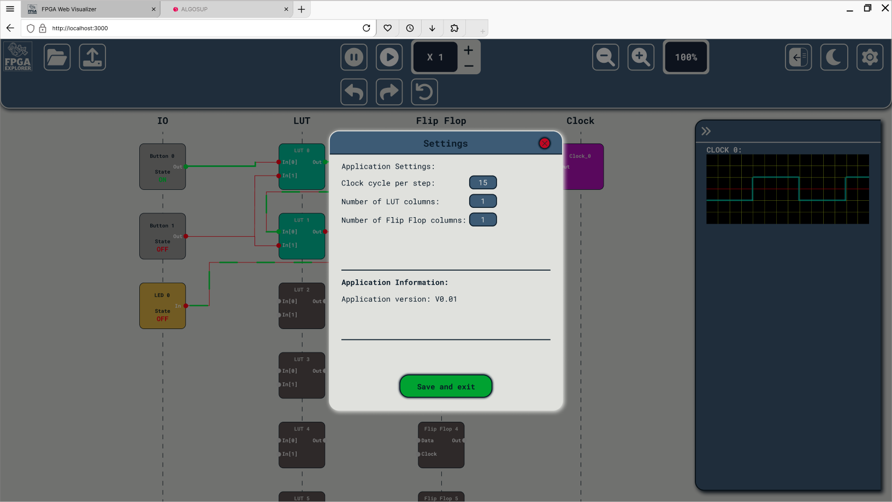

# Functional Specifications

---
**Title:** FPGA Explorer - Team 4

**Author:** Maxime CARON

**Team:** Team 4

**Reviewer:** Guillaume Despaux

**Created on:** February 25th, 2025

**Last updated:** March 13th, 2025

---
<h2 id="toc"> Table of Contents </h2>

<i>(Click to expand)</i>

- [Functional Specifications](#functional-specifications)
  - [Preamble](#preamble)
  - [1. Introduction](#1-introduction)
    - [1.1. Glossary](#11-glossary)
    - [1.2. Project Overview](#12-project-overview)
    - [1.3. Project Definition](#13-project-definition)
      - [1.3.1. Vision](#131-vision)
      - [1.3.2. State of the Art](#132-state-of-the-art)
      - [1.3.3. Scope](#133-scope)
      - [1.3.4. Deliverables](#134-deliverables)
    - [1.4. Project Organization](#14-project-organization)
      - [1.4.1. Project Representatives](#141-project-representatives)
      - [1.4.2. Team and Roles](#142-team-and-roles)
      - [1.4.3. Stakeholders](#143-stakeholders)
      - [1.4.4. Project Reviewers](#144-project-reviewers)
    - [1.5. Project Timeline](#15-project-timeline)
      - [1.5.1. Retro-Planning](#151-retro-planning)
      - [1.5.2. Milestones](#152-milestones)
      - [1.5.3. Resources](#153-resources)
      - [1.5.4. Assumptions](#154-assumptions)
      - [1.5.5. Constraints](#155-constraints)
  - [2. Audience and Use Cases](#2-audience-and-use-cases)
    - [2.1. Target Audience](#21-target-audience)
    - [2.2. User Personas](#22-user-personas)
    - [2.3. Use Cases List](#23-use-cases-list)
    - [2.4. Use Case Descriptions](#24-use-case-descriptions)
    - [2.4.1. Upload SDF File](#241-upload-sdf-file)
    - [2.4.2. Adjust Real-Time Clock Speed](#242-adjust-real-time-clock-speed)
    - [2.4.3. Control Simulation (Start, Pause, Reset)](#243-control-simulation-start-pause-reset)
    - [2.4.4. Step-By-Step Simulation Mode](#244-step-by-step-simulation-mode)
    - [1.4.5. Zoom Features](#145-zoom-features)
    - [1.4.6. Deploy Server Locally](#146-deploy-server-locally)
    - [1.4.7. Update Application Configuration](#147-update-application-configuration)
  - [3. UI/UX](#3-uiux)
    - [3.1. Inspiration](#31-inspiration)
    - [3.2. Wireframes](#32-wireframes)
      - [3.2.1. Main Page](#321-main-page)
      - [3.2.2. Settings Modal](#322-settings-modal)
      - [3.2.3. Information Messages](#323-information-messages)
    - [3.3. Mockups](#33-mockups)
      - [3.3.1 Light Mode](#331-light-mode)
        - [Main Page](#main-page)
        - [Settings Modal](#settings-modal)
        - [Information Messages](#information-messages)
      - [3.3.2. Dark Mode](#332-dark-mode)
        - [Main Page](#main-page-1)
        - [Settings Modal](#settings-modal-1)
        - [Information Messages](#information-messages-1)
    - [3.4. Logo](#34-logo)
  - [4. Functional Requirements](#4-functional-requirements)
    - [4.1. SDF File Upload](#41-sdf-file-upload)
    - [4.2. Real-Time Clock Speed Adjustment](#42-real-time-clock-speed-adjustment)
    - [4.3. Simulation Control](#43-simulation-control)
    - [4.4. Simulation Control Step-by-Step](#44-simulation-control-step-by-step)
    - [4.5. Real-Time Interactions](#45-real-time-interactions)
    - [4.6. Zoom Features](#46-zoom-features)
    - [4.7. Light and Dark Mode](#47-light-and-dark-mode)
    - [4.8. Settings Modal](#48-settings-modal)
    - [4.9. Information Messages](#49-information-messages)
      - [**Functionality**](#functionality)
      - [**Notice Messages**](#notice-messages)
      - [**Error Messages**](#error-messages)
  - [5. Non-Functional Requirements](#5-non-functional-requirements)
    - [5.1. Performance](#51-performance)
    - [5.2. Hosting Performance](#52-hosting-performance)
    - [5.3. Ease of Use](#53-ease-of-use)
    - [5.4. Compatibility](#54-compatibility)
  - [6. Recommended Minimum Hardware Requirements](#6-recommended-minimum-hardware-requirements)
    - [6.1. Server Requirements](#61-server-requirements)
    - [6.2. Screen Resolution](#62-screen-resolution)
    - [6.3. Supported Browsers](#63-supported-browsers)
    - [6.4. Operating Systems](#64-operating-systems)
  - [7. Future Improvements](#7-future-improvements)
    - [7.1. Advanced Simulation Controls](#71-advanced-simulation-controls)
    - [7.2. Realistic Chip Behavior](#72-realistic-chip-behavior)
    - [7.3. Collaborative Simulation](#73-collaborative-simulation)
  - [8. Legal and Compliance](#8-legal-and-compliance)
    - [8.1. Data Protection and Privacy](#81-data-protection-and-privacy)
    - [8.2. Accessibility](#82-accessibility)
    - [8.3. Security](#83-security)
    - [8.4. Intellectual Property](#84-intellectual-property)
  - [9. End Matter](#9-end-matter)
    - [9.1. Contributors](#91-contributors)
    - [9.2. License](#92-license)

---

## Preamble
*This document outlines the functional specifications for the development of a web interface designed to simulate the internal chip flows of an FPGA. This document serves as a comprehensive guide for the project's scope, requirements, and objectives, ensuring that all stakeholders have a clear understanding of the project's goals and deliverables.*

---
## 1. Introduction

### 1.1. Glossary

| Term | Definition   |
| ---- | --------- |
| **ALGOSUP** | A French educational institution focused on training students in digital technologies and soft skills. |
| **Clock Speed** | The frequency at which an FPGA or processor executes instructions, measured in Hertz (Hz). |
| **CNES** | *Centre National d'Études Spatiales*, the French government agency responsible for space research and exploration. |
| **Dark Mode** | A user interface theme with a dark background and light text, designed for low-light environments to reduce eye strain.  |
| **Figma** | A collaborative, web-based design tool for creating wireframes, mockups, and interactive prototypes.   |
| **Flip-Flop** | A digital circuit element that stores binary data, commonly used in sequential logic and state machines.     |
| **FPGA** | *Field-Programmable Gate Array*, an integrated circuit that can be reconfigured after manufacturing to perform specific digital logic functions. |
| **GitHub** | A cloud-based platform for version control and collaborative software development using Git repositories.    |
| **Hosting** | The service of storing and delivering web applications, websites, or data on a remote server accessible via the internet.      |
| **I/O (Input/Output)** | The communication interface between a system and external devices, such as sensors, displays, or peripherals.      |
| **Light Mode** | A user interface theme with a bright background and dark text, optimized for high-light environments.  |
| **LUT** | *Look-Up Table*, a core component in FPGA logic cells that implements combinational logic functions.   |
| **MIT License** | A permissive open-source license that allows free use, modification, and distribution of software with minimal restrictions.   |
| **Modal** | A temporary on-screen window that appears over the main interface to display additional content or request user input.   |
| **Mockup** | A static visual representation of a web interface or application design, used to demonstrate layout and functionality.   |
| **MS** | *Millisecond*, a unit of time equal to one-thousandth of a second. |
| **Post-Mortem** | A retrospective project analysis conducted after completion to assess successes, challenges, and lessons learned.  |
| **Responsive Design** | A design approach that ensures web content adapts dynamically to different screen sizes and devices for an optimal user experience.  |
| **SDF** | *Standard Delay Format*, a file format used to specify the timing characteristics of digital circuits for simulation purposes. |
| **Simulation** | The process of modeling and analyzing a system’s behavior over time to predict its performance and verify its design.    |
| **Step-by-Step Mode** | A simulation mode that allows users to advance the execution one step at a time for detailed debugging and analysis.     |
| **Tooltip** | A small informational pop-up appears when hovering over an interactive element, providing context or guidance.      |
| **Wireframe** | A low-fidelity visual representation of a web or application layout, outlining its structure and content placement.      |
| **Zoom** | A feature that enables users to magnify or reduce the display of a circuit or interface for better visibility and focus. |

### 1.2. Project Overview
This project aims to develop a user-friendly web interface for simulating the internal chip flows of an FPGA. This interface will enable teachers and students to easily upload SDF files, adjust real-time clock speeds, and view simulation results. By streamlining the simulation process, this tool will enhance the educational experience and provide a practical demonstration of FPGA behavior in classroom settings.

> [!NOTE]
> Clock is not based on real-time but on the simulation time, which can be adjusted by the user to be faster or slower.

### 1.3. Project Definition

#### 1.3.1. Vision
The vision of this project is to provide an open-source educational web platform for learning FPGA internal functioning and exploring the challenges associated with this technology.

Team objectives include:
- Developing a user-friendly web interface for simulating FPGA internal chip flows.
- Providing tools for uploading SDF files, adjusting clock speeds, and controlling simulations.
- Enhancing the educational experience for students and teachers through interactive real-time demonstrations.
- Ensuring the interface’s visual design is optimized for computer screens and video projectors.

#### 1.3.2. State of the Art
Currently, there is no dedicated web interface for FPGA internal chip flow simulation. Existing solutions rely on expensive, complex software unsuitable for educational use. These tools often have steep learning curves and are not designed for interactive real-time demonstrations. This project aims to fill that gap by offering a simple, accessible, and cost-effective solution.

Existing simulation tools:
| Tool    | Licence type  | Source | Limitations | Price  |
| - | ---- | --------- | -- | ------ |
| Xilinx Vivado | Vivado ML Enterprise Edition, Fixed license, NCNR | [🔗](https://www.amd.com/en/products/software/adaptive-socs-and-fpgas/vivado/vivado-buy.html#) | Complex interface, expensive, not educational   | $4,395 |
| Intel Quartus Prime | Quartus Prime Pro Edition, Fixed license    | [🔗](https://www.thailand.intel.com/content/dam/www/central-libraries/us/en/documents/quartus-prime-compare-editions-guide.pdf) | Complex interface, expensive, not educational   | $3,995 |
| Intel Quartus Prime | Quartus Prime Standard Edition, Fixed license     | [🔗](https://www.thailand.intel.com/content/dam/www/central-libraries/us/en/documents/quartus-prime-compare-editions-guide.pdf) | Complex interface, expensive, not educational   | $2,995 |
| Intel Quartus Prime | Quartus Prime Lite Edition      | [🔗](https://www.thailand.intel.com/content/dam/www/central-libraries/us/en/documents/quartus-prime-compare-editions-guide.pdf) | Complex interface, not educational, missing some simulation tools | Free   |

#### 1.3.3. Scope
This project will use the following technologies:

Frontend: Native JavaScript, HTML, CSS

Backend: Node.js with Express.js (subject to change based on project needs)

The final product will consist of a local server hosting a web interface accessible from any modern web browser. Users will be able to upload an SDF file that will be translated into a JSON file and then displayed on the web interface for simulation.

#### 1.3.4. Deliverables
| Deliverable   | Purpose | Document |
| ------- | ---- | -------- |
| Functional Specifications | Define project scope and requirements | [🔗](#functional-specifications) |
| Graphic Charter     | Define the visual identity of the web interface   | [🔗](./graphic-charter.md) |
| Technical Specifications  | Outline technical details and implementation plan | [🔗](./../technical-specifications/technical-specifications.md) |
| Test Plan     | Define testing procedures and criteria      | [🔗](./../quality-assurance/test-plan.md) |
| User Manual   | Provide instructions for using the web interface  | [🔗](./../user-manual/user-manual.pdf) |
| Source Code   | Share the project codebase with the community     | [🔗](./../../src) |

### 1.4. Project Organization

#### 1.4.1. Project Representatives
| Entities | Representative   |
| -------- | ------- |
| [CNES](https://www.cnes.fr/en) | Represented by [Florent MANNI](https://www.linkedin.com/in/florent-manni-182547211/) |
| [ALGOSUP](https://www.algosup.com) | Represented by [Franck JEANNIN](https://www.linkedin.com/in/franck-jeannin/) |
| [Thibaud MARLIER](https://www.linkedin.com/in/thibaudmarlier/) | Represented by [Maxime CARON](https://www.linkedin.com/in/maxime-caron-dev/) (Program Manager) |

#### 1.4.2. Team and Roles

| Full Name   | Role  | Role Description   | Contact     |
| -------- | -------- | --------- | -- |
| Thibaud MARLIER   | Project Manager   | Responsible for project planning, coordination, and communication  | [LinkedIn](https://www.linkedin.com/in/thibaudmarlier/) |
| Maxime CARON      | Program Manager   | Ensures project meets expectations; oversees design and functional specs | [LinkedIn](https://www.linkedin.com/in/maxime-caron-dev/) |
| Emilien CHINSY    | Technical Lead    | Oversees technical aspects, including architecture and implementation    | [LinkedIn](https://www.linkedin.com/in/emilien-chinsy-5a794632b/) |
| Guillaume DESPAUX | Quality Assurance | Ensures quality of deliverables and adherence to requirements      | [LinkedIn](https://www.linkedin.com/in/guillaume-despaux/) |
| Clementine CUREL  | Technical Writer  | Documents the project, including user manuals    | [LinkedIn](https://www.linkedin.com/in/clementinecurel/) |
| Jason GROSSO      | Software Engineer | Develops the web interface and simulation engine | [LinkedIn](https://www.linkedin.com/in/jason-grosso-847b39251/) |
| Laurent BOUQUIN    | Software Engineer | Develops the web interface and simulation engine | [LinkedIn](https://www.linkedin.com/in/laurentb22/) |

#### 1.4.3. Stakeholders

| Stakeholder      | Interest  |
| ------- | --- |
| CNES | Project initiator and primary beneficiary     |
| ALGOSUP    | Project collaborator and technology provider  |
| ALGOSUP Students | Developers and testers of the project   |
| Teachers   | End users of the web interface for educational purposes   |
| Students   | End users of the web interface for learning FPGA concepts |

#### 1.4.4. Project Reviewers
External project reviewers have been appointed by the project owner to review our specifications and provide us with feedback.

### 1.5. Project Timeline

#### 1.5.1. Retro-Planning

The project will be developed in 6 weeks, from 24th February 2025 to 4th April 2025.

#### 1.5.2. Milestones
| Date | Milestone     | Responsible      |
| - | ------- | - |
| 02/28/2025 | First Weekly Report | Thibaud MARLIER  |
| 03/07/2025 | Second Weekly Report      | Thibaud MARLIER  |
| 03/13/2025 | Functional Specifications | Maxime CARON     |
| 03/13/2025 | Graphic Charter     | Maxime CARON     |
| 03/14/2025 | Third Weekly Report | Thibaud MARLIER  |
| 03/21/2025 | Fourth Weekly Report      | Thibaud MARLIER  |
| 03/25/2025 | Technical Specifications  | Emilien CHINSY   |
| 03/25/2025 | Test Plan     | Guillaume DESPAUX      |
| 03/28/2025 | Fifth Weekly Report | Thibaud MARLIER  |
| 04/01/2025 | User Manual   | Clementine CUREL |
| 04/01/2025 | Source Code   | Jason GROSSO & Laurent BOUQUIN |
| 04/04/2025 | Final Presentation  | Entire Team      |
| 04/04/2025 | Final Report  | Thibaud MARLIER  |
| 04/04/2025 | Project Post-Mortem | Thibaud MARLIER  |

#### 1.5.3. Resources
- Team of 7 people
- Input from teachers and professionals at CNES
- Help from ALGOSUP teachers and professionals
- External project reviewers
- Open-source tools and libraries
- SDF file examples
- Estimated project time: 490 hours (10 days × 7 people × 7 hours/day)

#### 1.5.4. Assumptions
- It will be hosted on a local server and accessible via modern web browsers.
- The interface will accommodate users with varying technical expertise and adhere to accessibility guidelines.
- The project will be developed using waterfall methodology with weekly progress reports.
- The project will be reviewed by internal and external stakeholders for quality assurance.

#### 1.5.5. Constraints
- The project will use web technologies (HTML, CSS, JavaScript, Node.js, Express.js).
- The project is open source and free for educational use.
- It will be developed in English and tested on Chrome, Firefox, Safari, and Edge.
- It will be designed for ease of deployment on local machines with limited resources.
- The project will comply with relevant data protection and privacy regulations.

---
## 2. Audience and Use Cases

### 2.1. Target Audience
The target audience for this project includes teachers, students, and professionals interested in FPGA design and simulation. The web interface is designed to provide an educational platform for learning about FPGA internals and exploring the challenges associated with this technology. By offering an intuitive, interactive simulation tool, the project aims to engage users in hands-on learning experiences that bridge theoretical concepts with practical applications.

### 2.2. User Personas

- **Emily Thompson – CNES Teacher**
  

  
  

    <strong>Background:</strong> A passionate educator who integrates hands-on technology into her curriculum. 
    <strong>Goals:</strong> 
 - To demonstrate complex FPGA concepts through interactive, real-time simulations. 
 - To simplify the learning process with an intuitive, accessible interface. 
    <strong>Frustrations:</strong> 
 - Tools that are too complex or expensive. 
 - Lack of real-time interactivity that limits classroom engagement.
  

- **Mark Reynolds – Undergraduate Electrical Engineering Student**

  
  

    <strong>Background:</strong> An enthusiastic student eager to learn FPGA design and simulation. 
    <strong>Goals:</strong> 
 - To experiment with different simulation parameters (like clock speeds and step sizes) for deeper understanding. 
 - To use a tool that bridges theoretical concepts with practical application. 
    <strong>Frustrations:</strong> 
 - Limited hands-on opportunities with actual FPGA behavior. 
 - Overly technical interfaces that require steep learning curves.
  

- **Alex Kim – Software Developer & System Administrator**

  
  

    <strong>Background:</strong> Responsible for maintaining and updating the web interface, ensuring its performance and ease of deployment. 
    <strong>Goals:</strong> 
 - To provide a reliable, responsive simulation tool that meets both educational and technical requirements. 
 - To integrate user feedback for continuous improvement. 
    <strong>Frustrations:</strong> 
 - Unresponsive systems or frequent bugs that disrupt classroom sessions. 
 - Complex deployment processes that hinder local installations.
  

---
### 2.3. Use Cases List

| Use Case ID | Use Case Name | Description |
| -- | ---- | ----- |
| 1     | [Upload SDF File](#241-upload-sdf-file) | Users can upload an SDF file containing the FPGA's internal structure for simulation.     |
| 2     | [Adjust Real-Time Clock Speed](#242-adjust-real-time-clock-speed) | Users can adjust the simulation's clock speed in real time to observe different chip behaviors. |
| 3     | [Control Simulation (Start, Pause, Reset)](#243-control-simulation-start-pause-reset) | Users can start, pause, and reset the simulation to observe specific chip states.   |
| 4     | [Step-By-Step Simulation Mode ](#244-step-by-step-simulation-mode) | Users can advance the simulation step-by-step to analyze internal chip flows in detail.   |
| 5     | [Zoom Features](#245-zoom-features) | Users can zoom in and out of the chip's internal structure to focus on specific areas.    |
| 6     | [Deploy Server Locally](#246-deploy-server-locally) | Developers can deploy the simulation server locally for testing and development purposes. |
| 7     | [Update Application Configuration](#247-update-application-configuration) | Developers can update the application's configuration settings for customization and optimization. |

---

### 2.4. Use Case Descriptions

### 2.4.1. Upload SDF File

| Field | Description |
| ----- | ----------- |
| **Use Case ID** | 1 |
| **Use Case Name** | Upload SDF File |
| **Actor** | Emily Thompson |
| **Description** | Emily navigates to the simulation page and selects the "Upload SDF" option. The system validates the file format and size, then parses and visually renders the FPGA’s internal structure. |
| **Preconditions** | Emily is logged into the simulation interface. |
| **Postconditions** | The SDF file is successfully parsed and its contents are displayed. If validation fails, an error message is shown, and Emily is prompted to re-upload a valid file. |
| **Flow** | 1. Emily navigates to the simulation page. 2. She clicks the "Upload SDF" button. 3. She selects an SDF file from her local device. 4. The system validates the file format and size. 5. **Alternate Flow:** If validation fails, the system displays an error message and prompts re-upload. 6. If valid, the system parses the file. 7. The FPGA’s internal structure is rendered based on the parsed data. |

---

### 2.4.2. Adjust Real-Time Clock Speed

| Field | Description |
| ----- | ----------- |
| **Use Case ID** | 2 |
| **Use Case Name** | Adjust Real-Time Clock Speed |
| **Actor** | Emily Thompson |
| **Description** | Emily interacts with the clock speed controls (e.g., `+`/`-` buttons) to modify the simulation’s clock speed within a defined range (e.g., X0.25 to X32). The simulation updates immediately to reflect the new speed. |
| **Preconditions** | A simulation is loaded and either running or paused. |
| **Postconditions** | The simulation clock speed is updated accordingly. If an invalid value is entered, the system retains the previous valid setting and displays an error message. |
| **Flow** | 1. Emily clicks the `+` or `-` buttons to change the clock speed. 2. The system checks the input for validity. 3. **Alternate Flow:** If invalid, an error message is displayed and no change is made. 4. If valid, the system updates the simulation clock speed immediately. 5. A status message confirms the update. |

---

### 2.4.3. Control Simulation (Start, Pause, Reset)

| Field | Description |
| ----- | ----------- |
| **Use Case ID** | 3 |
| **Use Case Name** | Control Simulation (Start, Pause, Reset) |
| **Actor** | Emily Thompson |
| **Description** | Emily uses dedicated controls to start, pause, or reset the simulation. The interface provides visual cues and status indicators to inform her of the current simulation state. |
| **Preconditions** | An SDF file has been successfully uploaded and parsed. |
| **Postconditions** | The simulation transitions to the requested state (running, paused, or reset), and the interface updates accordingly. |
| **Flow** | 1. Emily clicks the "Start Simulation" button to begin the simulation. 2. While the simulation is running, she may click "Pause" to halt progress or "Reset" to restart. 3. The system updates the simulation state and displays the appropriate status indicator. 4. **Alternate Flow:** If she attempts to control the simulation before uploading an SDF file, the system prompts her to complete the file upload first. |

---

### 2.4.4. Step-By-Step Simulation Mode

| Field | Description |
| ----- | ----------- |
| **Use Case ID** | 4 |
| **Use Case Name** | Step-By-Step Simulation Mode |
| **Actor** | Emily Thompson |
| **Description** | Emily activates the step-by-step mode to advance or reverse the simulation by a predetermined number of clock cycles, allowing detailed analysis of internal chip flows. |
| **Preconditions** | The simulation is loaded, paused, and step-by-step mode is enabled. |
| **Postconditions** | The simulation advances or reverses by the specified number of clock cycles, and detailed internal behavior is displayed. |
| **Flow** | 1. Emily activates step-by-step mode. 2. She presses the "Step Forward" or "Step Back" button. 3. **Customization Option:** She can adjust the number of clock cycles per step if supported. 4. The system advances or reverses the simulation by the specified number of cycles. 5. The display updates to show the detailed internal chip flows. 6. **Alternate Flow:** If the simulation is not paused, the system prompts her to pause it before proceeding. |

---

### 1.4.5. Zoom Features

| Field | Description |
| ----- | ----------- |
| **Use Case ID** | 5 |
| **Use Case Name** | Zoom Features |
| **Actor** | Emily Thompson |
| **Description** | Emily uses zoom controls to magnify or reduce the display of the FPGA's internal structure, enabling her to focus on specific areas. |
| **Preconditions** | The simulation interface is loaded and the FPGA structure is displayed. |
| **Postconditions** | The view is adjusted (zoomed in or out) based on Emily's input, with the display scaling accordingly. |
| **Flow** | 1. Emily interacts with the zoom controls (buttons, slider, or mouse wheel). 2. The system adjusts the view to magnify or reduce the display. 3. The display updates in real-time to reflect the new zoom level. 4. **Alternate Flow:** If the input is ambiguous or unsupported, the system defaults to the nearest valid zoom level and shows a notification. |

---

### 1.4.6. Deploy Server Locally

| Field | Description |
| ----- | ----------- |
| **Use Case ID** | 6 |
| **Use Case Name** | Deploy Server Locally |
| **Actor** | Alex Kim |
| **Description** | Alex deploys the simulation server on a local machine to test and run the application in a controlled environment. |
| **Preconditions** | The application source code is available and dependencies are installed. |
| **Postconditions** | The server is successfully deployed and accessible via a modern web browser on the local network. |
| **Flow** | 1. Alex sets up the local development environment (installing Node.js, Express.js, etc.). 2. He deploys the application to the local server. 3. Alex accesses the application via a web browser to verify that it loads correctly. 4. **Alternate Flow:** If the deployment fails, the system logs an error and Alex is notified with troubleshooting instructions. |

---

### 1.4.7. Update Application Configuration

| Field | Description |
| ----- | ----------- |
| **Use Case ID** | 7 |
| **Use Case Name** | Update Application Configuration |
| **Actor** | Alex Kim |
| **Description** | Alex updates the application's configuration settings (e.g., server port, environment variables) through a configuration file. |
| **Preconditions** | The application is deployed and running on the local server. |
| **Postconditions** | The new configuration is applied successfully, and the application reflects the updated settings without errors. |
| **Flow** | 1. Alex accesses the configuration settings (via a config file). 2. He updates the necessary parameters (e.g., server port, database connections). 3. Alex saves the changes and restarts the application. 4. The application loads with the new configuration settings. 5. **Alternate Flow:** If configuration updates fail, an error message is logged and Alex is notified with recommendations for resolution. |

---
## 3. UI/UX

> [!NOTE]
> Mockups and wireframe designs are subject to change based on user feedback and project requirements.

> [!NOTE]
> More detailed design specifications can be found in the [Graphic Charter](./graphic-charter.md) document.

### 3.1. Inspiration
The user interface has been designed to provide an intuitive and engaging experience for teachers and students. The visual design is minimalistic, with a focus on clarity and ease of use. The color scheme is optimized for both light and dark modes to ensure readability in various environments. Interactive elements are designed to be accessible and responsive, allowing users to control the simulation with precision.

### 3.2. Wireframes

#### 3.2.1. Main Page

#### 3.2.2. Settings Modal

#### 3.2.3. Information Messages

### 3.3. Mockups

All the mockups are available in the [Figma project](https://www.figma.com/design/A6rvzTJCZQQyznhdQbu753/FPGA-Web-App?node-id=0-1&m=dev&t=lkPKlLFY9KAmra26-1).

> [!NOTE]
> Mockups are not interactive, they are static images.

#### 3.3.1 Light Mode

##### Main Page

##### Settings Modal

##### Information Messages
**Notice Message:**

**Error Message:**

#### 3.3.2. Dark Mode

##### Main Page

##### Settings Modal

##### Information Messages
**Notice Message:**

**Error Message:**

### 3.4. Logo

The logo design is inspired by the concept of a "chip" and "exploration". It features a stylized representation of a spaceman exploring a circuit board, symbolizing the educational journey of discovering FPGA internals.

<picture><source media="(prefers-color-scheme: dark)" srcset="images/logo-light.png"><source media="(prefers-color-scheme: light)" srcset="images/logo-dark.png">    </picture>

---
## 4. Functional Requirements

### 4.1. SDF File Upload  
- **Functionality:**  
 The web interface will allow users to upload SDF files containing the chip design information.  
- **Details:**  
  - The system shall support SDF file formats up to 10 MB in size.  
  - Upon file upload, the system will validate the file format and size. If the file is malformed or exceeds the allowed limit, a clear error message will be displayed.  
  - Successfully uploaded files will be parsed, and the chip’s internal structure will be rendered visually on the interface.

### 4.2. Real-Time Clock Speed Adjustment  
- **Functionality:**  
 Users will be able to adjust the simulation's clock speed in real time.  
- **Details:**  
  - A dedicated control will allow users to increase or decrease the clock speed by predefined increments (e.g., 1x, 2x, 4x, ...).
  - Changes to the clock speed will take effect immediately, with a tooltip displaying the current speed.

> [!NOTE]
> The SDF file initially provides a default clock speed in pico-seconds. The X1 clock speed dynamically adjusts the simulation time to make a clock period equal to 500 ms.

### 4.3. Simulation Control  
- **Functionality:**  
 The interface will provide controls for starting, pausing, and resetting the simulation.  
- **Details:**  
  - Visual cues such as play, pause, and reset buttons will be available to control the simulation flow.
  - Users can easily control the simulation flow to observe behaviors at their own pace.

### 4.4. Simulation Control Step-by-Step  
- **Functionality:**  
 The interface will offer a step-by-step simulation mode where users can advance the simulation a specified number of clock cycles at a time.  
- **Details:**  
  - This mode enables detailed observation of the chip's behavior at each simulation step.  

> [!NOTE]
> The default number of clock cycles per step is defined in the [Technical Specifications](../technical-specifications/technical-specifications.md) document.

### 4.5. Real-Time Interactions  
- **Functionality:**  
 Users will interact with the simulation through various input fields and buttons provided on the interface.  
- **Details:**  
  - The interactive elements are generated based on data specified in the uploaded SDF file.  
  - Users will not be able to add or modify these inputs directly within the interface to maintain simulation integrity.  
> [!NOTE]
> All input controls derived from the SDF file are read-only to prevent unintended alterations.

### 4.6. Zoom Features
- **Functionality:**  
 The interface will provide zoom features to allow users to focus on specific areas of the displayed circuit.
- **Details:**
  - Users can zoom in and out of the chip's internal structure using dedicated controls.
  - Zoom controls will use predefined zoom levels to maintain consistency and avoid distortion (e.g., 50%, 100%, 150%, ...).

### 4.7. Light and Dark Mode
- **Functionality:**  
 The interface will support light and dark modes to accommodate user preferences. This will allow users to keep a consistent experience across different devices (e.g., desktop, video projector).
- **Details:**
  - Users can toggle between light and dark modes using a dedicated control in the interface.
  - The interface will adapt its color scheme and contrast to ensure readability in both modes.

### 4.8. Settings Modal
- **Functionality:**  
 The interface will include settings modal to provide users with additional customization options and information.
- **Details:**
  - The settings modal will contain options for adjusting clock speed, enabling step-by-step mode, and adding columns for LUT and Flip-Flop.
  - The setting modal will also include the current version of the web interface and link to the GitHub repository.

### 4.9. Information Messages  

#### **Functionality**  
Information messages provide users with real-time feedback and guidance. They are displayed in the top-right corner of the screen and automatically disappear after **10 seconds**.  

#### **Notice Messages**  
Notice messages inform users of successful operations and provide guidance on interacting with the simulation.  

**Behavior:**  
- Displayed in the top-right corner.  
- Automatically disappear after **10 seconds**.  
- Indicate successful actions such as file uploads, clock speed adjustments, and simulation control changes.  

**Samples:**  
- **"Simulation started successfully."** – The simulation has started.  
- **"File uploaded successfully."** – The file has been uploaded.  
- **"Simulation file loaded."** – The simulation file has been loaded.  
- **"Playing simulation."** – The simulation is running.  
- **"Simulation paused."** – The simulation has been paused.  
- **"Simulation reset."** – The simulation has been reset.  
- **"Step completed."** – The simulation advanced by one step.  
- **"Step reversed."** – The simulation moved back by one step.  
- **"Speed adjusted."** – The simulation speed was updated.  
- **"Settings updated."** – The settings have been successfully applied.  

#### **Error Messages**  
Error messages alert users to issues and guide resolution.  

**Behavior:**  
- Displayed in the top-right corner.  
- Automatically disappear after **10 seconds**.  
- Inform users of errors related to file uploads, clock speed settings, simulation controls, and more.  

**Samples:**  
- **"Invalid file format."** – The uploaded file format is not supported.  
- **"File size exceeds the limit."** – The uploaded file is too large.  
- **"Invalid clock speed."** – The entered clock speed is not valid.  
- **"Simulation cannot start due to an internal error."** – A system error prevents the simulation from running.  
- **"Simulation cannot be paused due to an internal error."** – The pause operation failed due to an error.  
- **"Simulation cannot be reset due to an internal error."** – The reset operation failed due to an error.  
- **"Simulation already running."** – The simulation is already in progress and cannot be restarted.  
- **"Simulation not paused."** – The simulation is currently running and cannot resume from a paused state.  
- **"Simulation not reset."** – The simulation has not been reset.  
- **"Invalid step size."** – The step size entered is not valid.  
- **"Invalid zoom level."** – The zoom level is out of range.  
- **"Settings not updated."** – The new settings could not be applied.  

---
## 5. Non-Functional Requirements

### 5.1. Performance  
- **Responsiveness:**  
 The web interface must be highly responsive, providing real-time feedback to user interactions.  
  - **Requirement:** All interactive operations must complete within 100ms to be considered smooth.  
- **Simulation Engine Optimization:**  
 The simulation engine should be optimized for speed and efficiency to ensure smooth operation during simulations.
- **File Upload and Load:**  
  - **Requirement:** File upload and parsing processes can take up to 1 minute, depending on file size and complexity.  
  - **Error Handling:** In cases where the process exceeds the maximum allowed time, the system should display a status update and offer options to retry.

### 5.2. Hosting Performance  
- **Local Deployment:**  
 As the project is open source and free, any user with a reasonably modern computer should be able to run the server locally.  
  - **Requirement:** A "decent computer" is defined as one with at least 4GB of RAM and a 4-core CPU.  
  - **Scalability:** The application should maintain functionality under local deployment without requiring extensive configuration.

### 5.3. Ease of Use  
- **User Interface:**  
 The interface must be intuitive, easy to navigate, and provide clear instructions and visual cues to guide users through the simulation process.
  - **Guidance:** Onboarding instructions and tooltips should be available for first-time users.
  - **Accessibility:** The design should consider accessibility guidelines to ensure user usability.

### 5.4. Compatibility  
- **Browser Support:**  
 The web interface should be compatible with modern web browsers, including Chrome, Firefox, Safari, and Edge.  
- **Responsive Design:**  
 The interface must adapt to different screen sizes and resolutions, ensuring a consistent user experience on desktops, tablets, and smartphones.
  - **Reference:** Additional compatibility details can be found in the [Technical Specifications](../technical-specifications/technical-specifications.md) document.

> [!WARNING]
> The minimal screen resolution supported is 1024x768 pixels.

---

## 6. Recommended Minimum Hardware Requirements  

### 6.1. Server Requirements  
- **Processor:** Quad-core CPU (x86_64 or ARM64 recommended)  
- **Memory:** 4GB RAM  
- **Storage:** 10GB free disk space (for installation and temporary files)  

### 6.2. Screen Resolution  
- **Minimum:** 1024×768 pixels  
- **Recommended:** 1920×1080 pixels  

### 6.3. Supported Browsers  
- **Chrome:** Version 111 or later  
- **Firefox:** Version 116 or later  
- **Safari:** Version 15 or later  
- **Edge:** Version 112 or later  

### 6.4. Operating Systems  
- **Windows:** Windows 8 or later  
- **macOS:** macOS 10.13 or later  
- **Linux:** Ubuntu 18.04 or later  

> [!NOTE]  
> This app does not support Internet Explorer or other outdated browsers.  

> [!NOTE]  
> This app is not optimized for mobile devices, including smartphones and tablets.  

---
## 7. Future Improvements

### 7.1. Advanced Simulation Controls

  - **Functionality:** Enhance the simulation controls to include breakpoint settings, dynamic variable clock speeds, and customizable step sizes.  
  - **Details:** These controls will allow users to pause simulations at predetermined points, adjust clock speeds on the fly, and choose step increments ranging from 1 to 100 clock cycles. This will facilitate detailed debugging and deeper analysis of chip behavior.  
  - **End Goal:** To reduce simulation debugging time by at least 30% and provide flexible simulation stepping for both educational and research purposes.

### 7.2. Realistic Chip Behavior
  - **Functionality:** Expand the simulation engine to model realistic chip behavior by incorporating external environmental factors such as temperature, voltage fluctuations, and other dynamic conditions.  
  - **Details:** Environmental factors will be integrated using parameterized models and lookup tables derived from real-world measurements. This will allow the simulation to reflect subtle variations in chip performance under different conditions.  
  - **End Goal:** To achieve simulation accuracy within 5% of real-world measurements, providing a more immersive and educational experience that mirrors actual FPGA behavior.

### 7.3. Collaborative Simulation
  - **Functionality:** Introduce collaborative simulation features to enable multiple users to interact with the simulation simultaneously.  
  - **Details:** The interface will support shared dashboards and real-time collaboration tools, with role-based access control to manage simultaneous interactions and prevent conflicts.  
  - **End Goal:** To support at least 5 simultaneous users without performance degradation, thereby promoting interactive learning, knowledge sharing, and teamwork among students and researchers.

---
## 8. Legal and Compliance

### 8.1. Data Protection and Privacy

- Do not store or save any personal data on the website.

### 8.2. Accessibility

- The website will be used by a large number of students and must comply with accessibility standards to accommodate all types of disabilities. 
- Ensure the design and functionality adhere to inclusive accessibility guidelines

### 8.3. Security 

- Implement robust security measures to safeguard sensitive company information.
- Use strict authentication methods to ensure that only authorized CNES employees can access the website.
- Alternatively, the website can be deployed locally within CNES’s internal network to restrict external access entirely.

### 8.4. Intellectual Property

- Clearly state that the website and its content are the exclusive property of CNES.
- Include appropriate copyright notices to protect intellectual property rights.

---
## 9. End Matter

### 9.1. Contributors
| Pictures    | Full Name   | Role  | Role Description   | Contact     |
| -- | -------- | -------- | --------- | -- |
|      | Thibaud MARLIER   | Project Manager   | Responsible for project planning, coordination, and communication  | [LinkedIn](https://www.linkedin.com/in/thibaudmarlier/) |
|     | Maxime CARON      | Program Manager   | Ensures project meets expectations; oversees design and functional specs | [LinkedIn](https://www.linkedin.com/in/maxime-caron-dev/) |
|     | Emilien CHINSY    | Technical Lead    | Oversees technical aspects, including architecture and implementation    | [LinkedIn](https://www.linkedin.com/in/emilien-chinsy-5a794632b/) |
|  | Guillaume DESPAUX | Quality Assurance | Ensures quality of deliverables and adherence to requirements      | [LinkedIn](https://www.linkedin.com/in/guillaume-despaux/) |
|      | Clementine CUREL  | Technical Writer  | Documents the project, including user manuals    | [LinkedIn](https://www.linkedin.com/in/clementinecurel/) |
|       | Jason GROSSO      | Software Engineer | Develops the web interface and simulation engine | [LinkedIn](https://www.linkedin.com/in/jason-grosso-847b39251/) |
|     | Lauren BOUQUIN    | Software Engineer | Develops the web interface and simulation engine | [LinkedIn](https://www.linkedin.com/in/laurentb22/) |

### 9.2. License
This project is licensed under the MIT License - see the LICENSE file for details.
