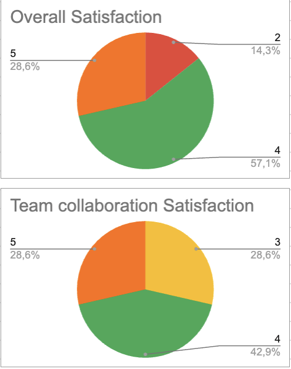

# **Weekly Report 2**

## **Overview**

This week was primarily focused on finalizing and submitting the first design prototype to the client, receiving feedback, and iterating on improvements. Additionally, progress was made on the functional specifications document and understanding the project's technical aspects, including the `.SDF` source file. The team also began implementing the foundational elements of the web interface.

## **Week 2 Objectives**

- Finalize the first design prototype
- Submit the prototype to the client and collect feedback
- Analyze client feedback and apply necessary improvements
- Continue working on the functional specifications document
- Gain a deeper understanding of the `.SDF` source file and its structure
- Begin implementing core elements of the web interface

## **Team Feedback**

### **Survey Questions**

The team was asked to rate their experience for the week based on the following questions:

**1. How satisfied are you with this week?** _(Rate from 1 to 5)_

- 1 - Very Unsatisfied
- 2 - Unsatisfied
- 3 - Neutral
- 4 - Satisfied
- 5 - Very Satisfied

**2. How would you rate the team's collaboration this week?** _(Rate from 1 to 5)_

- 1 - Very Poor
- 2 - Poor
- 3 - Average
- 4 - Good
- 5 - Excellent

### **Survey Results**

The team reported good communication, though a suggestion was made to create a shared document to track discussions and avoid losing important information.

On a more negative note, a few team members were absent on Thursday after a night out, which impacted productivity. They were informed that such unprofessional behavior should not be repeated to maintain the project's progress.

More details on the satisfaction survey can be found **[here](https://docs.google.com/spreadsheets/d/1EJIGbOufF86FP-Pb6Y5z0wuYymK0fEmoFKtg16JfIHg/edit?resourcekey=&gid=824804903#gid=824804903)**.

## **Project Progress**

- **First design prototype**: Completed and submitted to the client.
- **Functional specifications document**: The structure is finalized, and initial content has been drafted.
- **Web interface development**: The front-end implementation is nearly complete.
- **Technical analysis**: The Tech Lead and QA team successfully analyzed the `.SDF` input file and began working on parsing methods.
- **KPIs**: Initialization is complete.
- **Project schedule**: Established and updated.
- **Gantt chart**: Finalized and aligned with the project timeline.

## **Extras**

No additional tasks or contributions were made beyond planned objectives this week.

## **Challenges**

Some key challenges encountered this week:

- **Absenteeism**: A few team members were absent, affecting workflow and productivity.
- **Maintaining focus**: Staying consistently engaged in tasks proved difficult at times.

## **Next Week Plans**

- Ensure visual elements of the web interface function correctly and are fully responsive.
- Complete the functional specifications document.
- Make significant progress on the technical specifications document (at least 60% completion).
- Apply client feedback to refine the design prototype.
