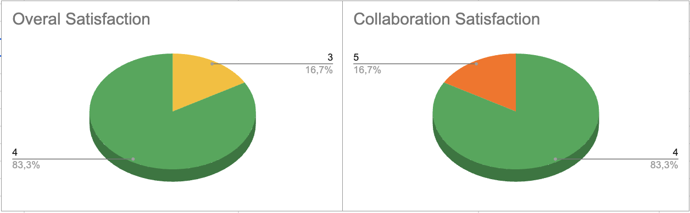

# **Weekly Report 3**  

## **Overview**  

This week primarily focused on finalizing, reviewing, and submitting the **Functional Specifications**. The team also made significant progress on the **back-end development** of the web interface while refining and improving the **front-end design**. Additionally, procedural generation for visual elements was implemented to enhance the user experience.

## **Week 3 Objectives**  

- **Ensure visual elements function correctly and are fully responsive.**  
- **Complete and submit the Functional Specifications document.**  
- **Achieve at least 60% completion of the Technical Specifications document.**  
- **Incorporate client feedback to refine the design prototype.**  

## **Team Feedback**  

### **Survey Questions**  

The team was asked to rate their experience for the week based on the following questions:  

**1. How satisfied are you with this week?** _(Rate from 1 to 5)_  
- 1 - Very Unsatisfied  
- 2 - Unsatisfied  
- 3 - Neutral  
- 4 - Satisfied  
- 5 - Very Satisfied  

**2. How would you rate the team's collaboration this week?** _(Rate from 1 to 5)_  
- 1 - Very Poor  
- 2 - Poor  
- 3 - Average  
- 4 - Good  
- 5 - Excellent  

### **Survey Results**  

The team reported steady progress, but some difficulties arose in **staying focused**. The **delayed review of the Functional Specifications** led to a time crunch, impacting the design phase schedule. However, client feedback on the first prototype was **overall positive**, despite requesting for a few changes.  

## **Project Progress**  

- **Finalization and Submission of Functional Specifications**  
  - The document was completed and sent to the client for review on **Friday**.  

- **Development of the .SDF Parser**  
  - The parser was successfully implemented, converting its content into **JSON format**.  
  - The original **C++ version** was translated into **JavaScript** for compatibility and dependency reasons.  
  
- **Integration of JSON Data into the Web Interface**  
  - JSON output is now being processed to dynamically generate elements.  
  
- **Procedural Generation for Web Interface Elements**  
  - Elements are now created automatically based on JSON content.  
  
- **GitHub Actions Finalization**  
  - Continuous integration and automated workflows were set up.  
  
- **Client Communication Tracking Document**  
  - A structured document was created to keep track of all **client-team interactions**.

## **Extras**  

- **User Manual**  
  - Skeleton version completed.  
  - Initial modeling of content structure began.  

## **Challenges**  

- **Time Constraints on Functional Specifications**  
  - The review process took longer than expected.  
  - Last-minute changes were required, leading to a rushed finalization.  
  
- **Web Interface Element Connections**  
  - The development team reported challenges in **accurately linking elements**.  
  - The current method caused some **visual clutter**, making the UI less intuitive.  
  
- **Focus and Productivity Issues**  
  - Some team members struggled with maintaining focus throughout the week.  
  
- **Design Phase Delay**  
  - The focus on Functional Specifications resulted in **delayed progress** on **Design Prototype 2**.  
  - However, the client provided **positive feedback** on the first prototype, with a few requested modifications.  

## **Next Week Plans**  

Most of the plans will be delayed from week 4 to week 5 as only half a day of project time is allocated to us next week. 

- **Develop and finalize Design Prototype 2.**  
- **Complete the near-final version of the Technical Specifications document.**  
- **Enhance the Web Interface:**  
  - Ensure correct **connections** between elements.  
  - Improve **procedural generation** of elements.  
  - Optimize **visual connections** to reduce clutter and improve readability.  

