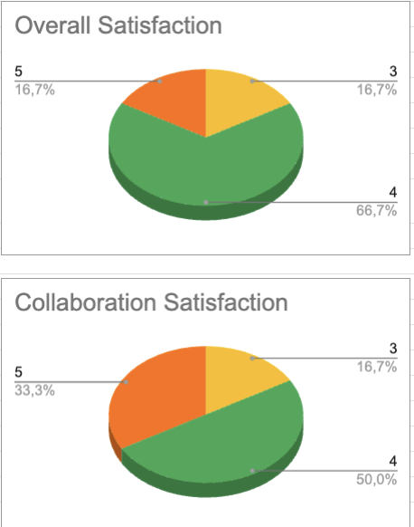

# **Weekly Report 5**

## **Overview**

This was the final week with allocated project time before the deadline. The team had significant time to work on the project, leading to major progress in both documentation and code. The primary goal was to finalize all essential documents and refine the web interface.

## **Week 5 Objectives**

- **Complete the Technical Specifications document**
- **Finalize the Test Plan document**
- **Publish the Test Plan and Technical Specifications documents**
- **Implement animations in the web interface**
- **Make significant progress on the User Manual**

## **Team Feedback**

### **Survey Questions**

The team was asked to rate their experience for the week based on the following questions:

- **How satisfied are you with this week? (Rate from 1 to 5)**

  - 1 - Very Unsatisfied
  - 2 - Unsatisfied
  - 3 - Neutral
  - 4 - Satisfied
  - 5 - Very Satisfied

- **How would you rate the team's collaboration this week? (Rate from 1 to 5)**
  - 1 - Very Poor
  - 2 - Poor
  - 3 - Average
  - 4 - Good
  - 5 - Excellent

### **Survey Results**

The team’s morale significantly improved this week. This was due to the substantial project time available, which allowed for considerable progress. Both the **Technical Specifications** and **Test Plan** documents were completed and published.

Additionally, the positive atmosphere among team members contributed to an overall sense of accomplishment.

You can find a more detailed breakdown following this link: [Link to week's 5 KPIs](https://docs.google.com/spreadsheets/d/1EJIGbOufF86FP-Pb6Y5z0wuYymK0fEmoFKtg16JfIHg/edit?usp=sharing)

## **Project Progress**

- **Technical Specifications Document**

  - Finalized and published
  - Sent for client review

- **Test Plan**

  - Finalized and published

- **User Manual**

  - Reached 90% completion
  - First version published

- **Web Interface**

  - One animation implemented, but it does not yet function in real-time or accurately represent live data

- **Final Presentation**
  - The team attended a preparation session for the final presentation
  - Progress on the presentation was minimal due to this session

## **Challenges**

- **Formatting Issues in the Technical Specifications Document**

  - Code blocks and formatting were disrupted during spell-checking and finalization
  - Immediate corrections were required before publication

- **Web Interface Timing Issues**
  - The animation does not accurately display the concurrent propagation of electrical signals
  - No further improvements will be made due to lack of allocated project time before the final deadline

## **Next Week Plans**

- **Prepare the oral presentation**
- **Finalize and publish the User Manual**
- **Write and format the README file**
- **Final refactoring and code documentation (overtime hours if necessary)**
- **Deliver the final presentation**
- **Conduct a post-mortem analysis of the project**
