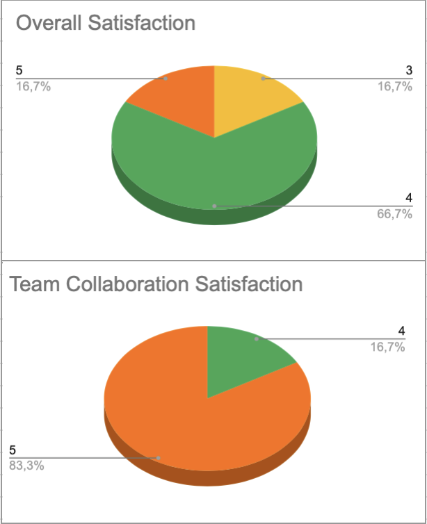

# **Weekly Report 6**

## **Overview**

This week marked the final week of the project, with all efforts focused on preparing for the final presentation. The team collaborated to refine the web interface, create and rehearse the presentation, and finalize post-mortem documentation.

## **Week 6 Objectives**

- **Fix remaining bugs in the web interface**
- **Collaborate on creating the final presentation**
- **Individually learn assigned presentation parts**
- **Support teammates by reviewing and refining their sections**
- **Deliver the final presentation**
- **Gather feedback from the client and the team**
- **Distribute post-mortem documents to the team and client**

## **Team Feedback**

### **Survey Questions**

The team was asked to rate their experience for the week based on the following questions:

- **How satisfied are you with this week? (Rate from 1 to 5)**

  - 1 - Very Unsatisfied
  - 2 - Unsatisfied
  - 3 - Neutral
  - 4 - Satisfied
  - 5 - Very Satisfied

- **How would you rate the team's collaboration this week? (Rate from 1 to 5)**
  - 1 - Very Poor
  - 2 - Poor
  - 3 - Average
  - 4 - Good
  - 5 - Excellent

### **Survey Results**

Team morale remained steady this week. Members were satisfied with how the final presentation went and appreciated the strong team spirit. Many supported each other during preparation, ensuring a smooth and confident delivery.

More details on the satisfaction survey can be found [here](https://docs.google.com/spreadsheets/d/1EJIGbOufF86FP-Pb6Y5z0wuYymK0fEmoFKtg16JfIHg/edit?usp=sharing).

## **Project Progress**

- **Final Presentation Preparation**

  - Created and structured the presentation slides
  - Wrote individual speaking notes for each section
  - Conducted multiple rehearsals
  - Successfully presented to the client

- **Post-Mortem Documentation**

  - Created Google Forms for collecting feedback from the client and team
  - Sent post-mortem documents to all stakeholders

- **Finalization Tasks**
  - Completed and finalized KPIs
  - Officially closed the project

## **Challenges**

- **Unexpected Delay**

  - External factors outside of the team’s control resulted in losing half a day of project time.

- **Language Barriers**
  - Some team members faced difficulties with English while preparing the oral presentation.
  - These issues were mitigated with the help of **Emilien Chinsy**, who assisted with translations and language clarity.

## **Next Week Plans**

- Take a well-deserved break and rest after project completion.
- Wait for the client’s response to the satisfaction form.
- Compile the collected feedback into a final post-mortem document.
