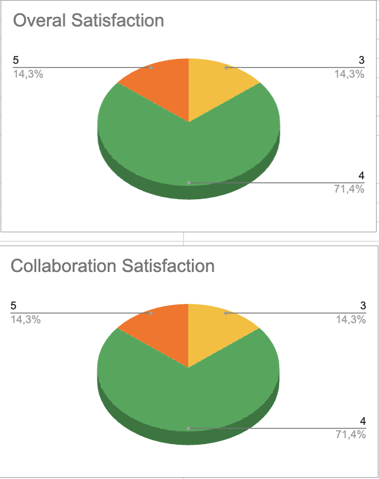

# Weekly Report Cumulative

Table of Contents

- [Weekly Report Cumulative](#weekly-report-cumulative)
- [**Weekly Report 1**](#weekly-report-1)
  - [**Overview**](#overview)
  - [**Week 1 Objectives**](#week-1-objectives)
  - [**Team Feedback**](#team-feedback)
    - [**Survey Questions**](#survey-questions)
    - [**Survey Results**](#survey-results)
  - [**Project Progress**](#project-progress)
  - [**Extras**](#extras)
  - [**Challenges**](#challenges)
  - [**Next Week Plans**](#next-week-plans)
- [**Weekly Report 2**](#weekly-report-2)
  - [**Overview**](#overview-1)
  - [**Week 2 Objectives**](#week-2-objectives)
  - [**Team Feedback**](#team-feedback-1)
    - [**Survey Questions**](#survey-questions-1)
    - [**Survey Results**](#survey-results-1)
  - [**Project Progress**](#project-progress-1)
  - [**Extras**](#extras-1)
  - [**Challenges**](#challenges-1)
  - [**Next Week Plans**](#next-week-plans-1)
- [**Weekly Report 3**](#weekly-report-3)
  - [**Overview**](#overview-2)
  - [**Week 3 Objectives**](#week-3-objectives)
  - [**Team Feedback**](#team-feedback-2)
    - [**Survey Questions**](#survey-questions-2)
    - [**Survey Results**](#survey-results-2)
  - [**Project Progress**](#project-progress-2)
  - [**Extras**](#extras-2)
  - [**Challenges**](#challenges-2)
  - [**Next Week Plans**](#next-week-plans-2)
- [**Weekly Report 4**](#weekly-report-4)
  - [**Overview**](#overview-3)
  - [**Week 4 Objectives**](#week-4-objectives)
  - [**Team Feedback**](#team-feedback-3)
    - [**Survey Questions**](#survey-questions-3)
    - [**Survey Results**](#survey-results-3)
  - [**Project Progress**](#project-progress-3)
  - [**Challenges**](#challenges-3)
  - [**Next Week Plans**](#next-week-plans-3)

# **Weekly Report 1**

## **Overview**

This week marked the project's first steps. The primary focus was on understanding the project's requirements, identifying the client’s needs, initializing the project structure, and starting the design phase. Additionally, discussions took place regarding the technology stack and technical specifications.

## **Week 1 Objectives**

- **Understand Project Requirements**

  - Conduct a meeting with the client to gather detailed information.
  - Clarify the project scope, expectations, and technical specifications.

- **Identify Client’s Needs**

  - Analyze the client’s vision for the project.
  - Define the project’s purpose and intended outcomes.
  - Draft and validate a Project Charter.

- **Project Initialization**

  - Set up version control and branch security.
  - Initiate the Work Breakdown Structure (WBS) and Gantt Chart.
  - Establish project management tools and frameworks.

- **Start the Design Phase**
  - Develop the first design prototype.
  - Create initial UI components and logotypes.

## **Team Feedback**

### **Survey Questions**

The team was asked to rate their experience for the week based on the following questions:

**1. How satisfied are you with this week?** _(Rate from 1 to 5)_

- 1 - Very Unsatisfied
- 2 - Unsatisfied
- 3 - Neutral
- 4 - Satisfied
- 5 - Very Satisfied

**2. How would you rate the team's collaboration this week?** _(Rate from 1 to 5)_

- 1 - Very Poor
- 2 - Poor
- 3 - Average
- 4 - Good
- 5 - Excellent

### **Survey Results**

The team reported good communication, and no major concerns were raised. However, focus levels could be improved, as discussions sometimes became too noisy.

More details on the satisfaction survey can be found **[here](https://docs.google.com/spreadsheets/d/1EJIGbOufF86FP-Pb6Y5z0wuYymK0fEmoFKtg16JfIHg/edit?resourcekey=&gid=322050487#gid=322050487)**.

## **Project Progress**

- **Project Requirements & Client Meeting**

  - A meeting was held on **Tuesday, February 25th**, to clarify project requirements.  
    The client outlined the goal of developing a web interface for an FPGA simulator to help students understand FPGA functionality.
  - Expectations regarding project functionalities and technical constraints were discussed.

- **Client Needs & Documentation**

  - A brainstorming session was conducted on **February 28th** to align with the client’s vision.
  - A **Project Charter** was drafted and sent to the client for validation.
  - A **MoSCoW prioritization chart** was created to categorize features based on importance.

- **Project Initialization**

  - **Version Control & Branch Security**: Set up by **Emilien Chinsy** to ensure workflow consistency.
  - **WBS & Gantt Chart**: Initialized by **Thibaud Marlier** to structure and schedule project tasks.
  - **Satisfaction Form**: Created by **Thibaud Marlier** for continuous feedback.
  - **Weekly Report Framework**: Designed by **Thibaud Marlier** to maintain reporting consistency.
  - **Naming Conventions Document**: Established and documented **[here](../../technical-specifications/naming-conventions.md)**.

- **Design Phase**
  - **Prototype Development**: **Maxime Caron** and **Clémentine Curel** began working on the first UI prototype.
  - **Logotyping & UI Components**: **Clémentine Curel** started creating logos, banners, and interface elements.

## **Extras**

- **Technology Stack Selection**

  - **Laurent Bouquin, Jason Grosso, and Emilien Chinsy** discussed and selected **HTML, CSS, TypeScript, and Node.js** as the project’s core technologies.

- **Technical Specifications**
  - Initial discussions led to the **first draft of the technical specifications document**.

## **Challenges**

- **Complexity of FPGA Technologies**

  - Fully grasping the technical requirements posed initial challenges.

- **Lack of Information**

  - Some critical details are still missing from the client, causing minor delays.

- **Design Process Efficiency**
  - The iterative nature of design development requires structured feedback and refinements.

## **Next Week Plans**

- **Finalize the First Design Prototype**

  - Complete and submit the initial UI prototype to the client.

- **Iterate Based on Client Feedback**

  - Adjust the Project Charter and prototype as needed.

- **Begin Second Prototype Development**

- **Start Functional Specifications Document**

  - **Maxime Caron** will begin drafting the web interface’s functional specifications.

- **Complete KPI Initialization**

- **Plan & Break Down Tasks Further**

- **Initialize the Code Environment**
  - **Laurent Bouquin, Jason Grosso, and Emilien Chinsy** will collaborate on setting up the coding environment.

---

# **Weekly Report 2**

## **Overview**

This week was primarily focused on finalizing and submitting the first design prototype to the client, receiving feedback, and iterating on improvements. Additionally, progress was made on the functional specifications document and understanding the project's technical aspects, including the `.SDF` source file. The team also began implementing the foundational elements of the web interface.

## **Week 2 Objectives**

- Finalize the first design prototype
- Submit the prototype to the client and collect feedback
- Analyze client feedback and apply necessary improvements
- Continue working on the functional specifications document
- Gain a deeper understanding of the `.SDF` source file and its structure
- Begin implementing core elements of the web interface

## **Team Feedback**

### **Survey Questions**

The team was asked to rate their experience for the week based on the following questions:

**1. How satisfied are you with this week?** _(Rate from 1 to 5)_

- 1 - Very Unsatisfied
- 2 - Unsatisfied
- 3 - Neutral
- 4 - Satisfied
- 5 - Very Satisfied

**2. How would you rate the team's collaboration this week?** _(Rate from 1 to 5)_

- 1 - Very Poor
- 2 - Poor
- 3 - Average
- 4 - Good
- 5 - Excellent

### **Survey Results**

The team reported good communication, though a suggestion was made to create a shared document to track discussions and avoid losing important information.

On a more negative note, a few team members were absent on Thursday after a night out, which impacted productivity. They were informed that such unprofessional behavior should not be repeated to maintain the project's progress.

More details on the satisfaction survey can be found **[here](https://docs.google.com/spreadsheets/d/1EJIGbOufF86FP-Pb6Y5z0wuYymK0fEmoFKtg16JfIHg/edit?resourcekey=&gid=824804903#gid=824804903)**.

## **Project Progress**

- **First design prototype**: Completed and submitted to the client.
- **Functional specifications document**: The structure is finalized, and initial content has been drafted.
- **Web interface development**: The front-end implementation is nearly complete.
- **Technical analysis**: The Tech Lead and QA team successfully analyzed the `.SDF` input file and began working on parsing methods.
- **KPIs**: Initialization is complete.
- **Project schedule**: Established and updated.
- **Gantt chart**: Finalized and aligned with the project timeline.

## **Extras**

No additional tasks or contributions were made beyond planned objectives this week.

## **Challenges**

Some key challenges encountered this week:

- **Absenteeism**: A few team members were absent, affecting workflow and productivity.
- **Maintaining focus**: Staying consistently engaged in tasks proved difficult at times.

## **Next Week Plans**

- Ensure visual elements of the web interface function correctly and are fully responsive.
- Complete the functional specifications document.
- Make significant progress on the technical specifications document (at least 60% completion).
- Apply client feedback to refine the design prototype.

---

# **Weekly Report 3**

## **Overview**

This week primarily focused on finalizing, reviewing, and submitting the **Functional Specifications**. The team also made significant progress on the **back-end development** of the web interface while refining and improving the **front-end design**. Additionally, procedural generation for visual elements was implemented to enhance the user experience.

## **Week 3 Objectives**

- **Ensure visual elements are responsive according to the requirements specified in the functional specifications.**
- **Complete and submit the Functional Specifications document.**
- **Achieve at least 60% completion of the Technical Specifications document.**
- **Incorporate client feedback to refine the design prototype.**

## **Team Feedback**

### **Survey Questions**

The team was asked to rate their experience for the week based on the following questions:

**1. How satisfied are you with this week?** _(Rate from 1 to 5)_

- 1 - Very Unsatisfied
- 2 - Unsatisfied
- 3 - Neutral
- 4 - Satisfied
- 5 - Very Satisfied

**2. How would you rate the team's collaboration this week?** _(Rate from 1 to 5)_

- 1 - Very Poor
- 2 - Poor
- 3 - Average
- 4 - Good
- 5 - Excellent

### **Survey Results**

The team reported steady progress, but some difficulties arose in **staying focused**. The **delayed review of the Functional Specifications** led to a time crunch, impacting the design phase schedule. However, client feedback on the first prototype was **overall positive**, despite requesting for a few changes.

More details on the satisfaction survey can be found [here.](https://docs.google.com/spreadsheets/d/1EJIGbOufF86FP-Pb6Y5z0wuYymK0fEmoFKtg16JfIHg/edit?usp=sharing)

## **Project Progress**

- **Finalization and Submission of Functional Specifications**

  - The document was completed and sent to the client for review on **Friday**.

- **Development of the .SDF Parser**
  - The parser was successfully implemented, converting its content into **JSON format**.
  - The original **C++ version** was translated into **JavaScript** for compatibility and dependency reasons.
- **Integration of JSON Data into the Web Interface**
  - JSON output is now being processed to dynamically generate elements.
- **Procedural Generation for Web Interface Elements**
  - Elements are now created automatically based on JSON content.
- **GitHub Actions Finalization**
  - Continuous integration and automated workflows were set up.
- **Client Communication Tracking Document**
  - A structured document was created to keep track of all **client-team interactions**.

## **Extras**

- **User Manual**
  - Skeleton version completed.
  - Initial modeling of content structure began.

## **Challenges**

- **Time Constraints on Functional Specifications**
  - The review process took longer than expected.
  - Last-minute changes were required, leading to a rushed finalization.
- **Web Interface Element Connections**
  - The development team reported challenges in **accurately linking elements**.
  - The current method caused some **visual clutter**, making the UI less intuitive.
- **Focus and Productivity Issues**
  - Some team members struggled with maintaining focus throughout the week.
- **Design Phase Delay**
  - The focus on Functional Specifications resulted in **delayed progress** on **Design Prototype 2**.
  - However, the client provided **positive feedback** on the first prototype, with a few requested modifications.

## **Next Week Plans**

Most of the plans will be delayed from week 4 to week 5 as only half a day of project time is allocated to us next week.

- **Develop and finalize Design Prototype 2.**
- **Complete the near-final version of the Technical Specifications document.**
- **Enhance the Web Interface:**
  - Ensure correct **connections** between elements.
  - Improve **procedural generation** of elements.
  - Optimize **visual connections** to reduce clutter and improve readability.

---

# **Weekly Report 4**

## **Overview**

This week had a significantly reduced project time, with only 3 hours and 30 minutes allocated on Monday afternoon. Due to this, the team did not expect major progress but still aimed to accomplish key tasks within the limited timeframe.

## **Week 4 Objectives**

- **Rework the UI according to slight modifications made to the design**
- **Make progress on the technical specifications document**
- **Make progress on the test plan document**
- **Make progress on the user manual**
- **Start working on the animations for the visual interface**

## **Team Feedback**

### **Survey Questions**

The team was asked to rate their experience for the week based on the following questions:

- **How satisfied are you with this week? (Rate from 1 to 5)**

  - 1 - Very Unsatisfied
  - 2 - Unsatisfied
  - 3 - Neutral
  - 4 - Satisfied
  - 5 - Very Satisfied

- **How would you rate the team's collaboration this week? (Rate from 1 to 5)**
  - 1 - Very Poor
  - 2 - Poor
  - 3 - Average
  - 4 - Good
  - 5 - Excellent

### **Survey Results**

The team expressed frustration due to the limited project time, as it constrained the progress they had hoped to make. However, small breakthroughs were achieved, which kept the team motivated for the upcoming week. Given the nearing project deadline, the team is committed to maximizing productivity in the following week.

More details on the satisfaction survey can be found [here.](https://docs.google.com/spreadsheets/d/1EJIGbOufF86FP-Pb6Y5z0wuYymK0fEmoFKtg16JfIHg/edit?usp=sharing)

## **Project Progress**

- **UI Adjustments**: Most mockups were reworked according to client feedback.
- **Visual Enhancements**: UI elements such as colors and the clock were successfully updated.
- **Project Documentation**:
  - Significant progress on the test plan, technical specifications, and user manual.
- **Team Well-Being**: The team found time to rest and recharge for the final stretch of the project.

## **Challenges**

- **Test Cases**: The test cases had to be restarted from scratch due to issues in the initial versions.
- **Limited Work Hours**: The reduced project time restricted the amount of work that could be completed this week.

## **Next Week Plans**

- **Complete the Technical Specifications document**
- **Finalize the Test Plan document**
- **Publish the Test Plan and the Technical Specifications documents**
- **Implement animations in the web interface**
- **Make significant progress on the User Manual**
