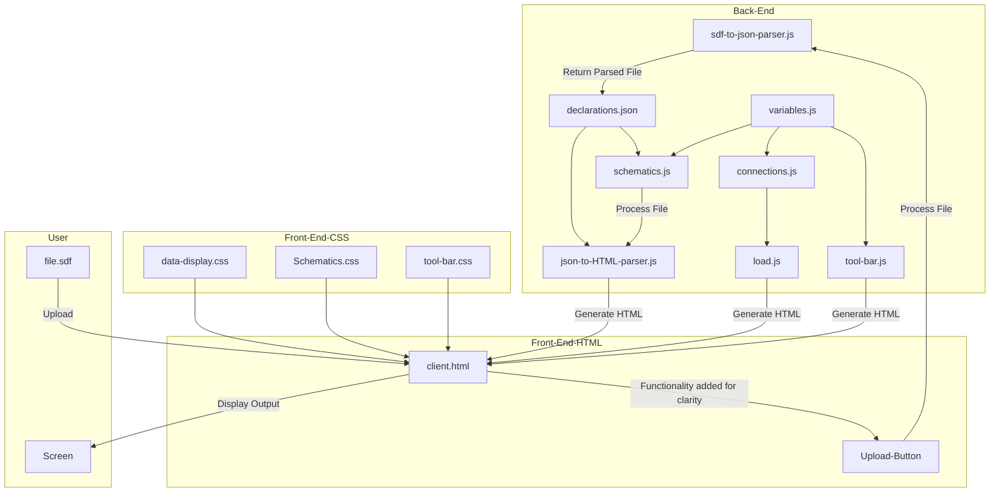

# 2024-2025 - Project 4 - Web FPGA - Team 4 - Technical Specifications

<summary> 

## Table of contents </summary>

- [2024-2025 - Project 4 - Web FPGA - Team 4 - Technical Specifications](#2024-2025---project-4---web-fpga---team-4---technical-specifications)
  - [Table of contents ](#table-of-contents-)
  - [Project Overview](#project-overview)
    - [Project Introduction](#project-introduction)
    - [Document Purpose](#document-purpose)
  - [Scope](#scope)
  - [Tasks](#tasks)
    - [Designing the web interface and the User Interface](#designing-the-web-interface-and-the-user-interface)
    - [Parsing from SDF to JSON](#parsing-from-sdf-to-json)
    - [Coding the web interface and the User Interface](#coding-the-web-interface-and-the-user-interface)
    - [Parsing from JSON to HTML](#parsing-from-json-to-html)
    - [Back-End development](#back-end-development)
    - [Animations](#animations)
    - [Documentation](#documentation)
    - [Testing, Debugging and reviewing](#testing-debugging-and-reviewing)
    - [Task handling](#task-handling)
    - [Task distribution](#task-distribution)
  - [System Overview](#system-overview)
    - [System Architecture](#system-architecture)
    - [Software Architecture Diagram](#software-architecture-diagram)
  - [Glossary](#glossary)

## Project Overview

### Project Introduction
This project was commissioned by the CNES (Centre National d'Études Spatiales)<sup><a href="#1">[1]</a></sup>. The objective is to develop a web page that assists teachers in explaining how FPGAs (Field Programmable Gate Arrays)<sup><a href="#2">[2]</a></sup> function. The web page will achieve this by visualizing an example or simulation of the internal FPGA processes when specific code is input.

The website will utilize information stored in SDF (Standard Delay Format)<sup><a href="#3">[3]</a></sup> files. These files will be parsed and converted into a .JSON format.

Our primary audience is:

- **Teachers** who will use the tool to teach their students.
- **Students** who will interact with the simulator to discover FPGA's and help them understand FPGA behavior.

Since the primary goal is education, user experience (UX) and user interface (UI) design will be the focus as they are crucial to the project's success.

### Document Purpose
This document provides detailed technical specifications for the development of the web page, ensuring the correct implementation of the required features. These specifications will be based on the functional specification (link to be added).

This tool is being developed at the CNES's request and will serve as an educational resource for teachers to explain the inner workings of FPGA's.

## Scope
The project is divided into two main parts:

1. **Front-end**: The web-based interface that users will see and interact with. This includes the visualization of the FPGA structure and signal propagation, as well as the user interface.
2. **Back-end**: The code that handles file uploads, translates the .SDF file into HTML code and injects it back onto the page.

| Part          | In Scope                                                                                                                                                                                          | Out of Scope                                                                                                                                                                                        |
| ------------- | ------------------------------------------------------------------------------------------------------------------------------------------------------------------------------------------------- | --------------------------------------------------------------------------------------------------------------------------------------------------------------------------------------------------- |
| **Front-end** | - Representation of the FPGA structures and signal propagation of the provided file. <br> - User interface for uploading .SDF files. <br> - Manual simulation control (start, stop, pause, step). | - Advanced features like debugging, and waveform analysis. <br> - Support for complex FPGA architectures and designs. |
| **Back-end**  | - Handling .SDF file uploads and parsing. <br> - translating the .SDF file to HTML code and sending it to the front-end.          | - Full-scale FPGA synthesis or hardware implementation. <br> - Integration with proprietary FPGA vendor tools.                                                                       |

The programming languages we will use for this project are as follows:

- **Front-end**: HTML, CSS and JavaScript.
- **Back-end**: Node.js(only for testing, development and debug) and JavaScript

## Tasks

Here are the tasks we will need to accomplish in order to finish the project:

### Designing the web interface and the User Interface
The first step is to design the web interface and write graphical charters to allow the development team to start working on the UI as soon as possible. the mockups will be made using Figma and are available [here](https://www.figma.com/design/A6rvzTJCZQQyznhdQbu753/FPGA-Web-App?node-id=0-1&m=dev&t=lkPKlLFY9KAmra26-1). And the graphical charter is available [here](../functional-specifications/graphical-charter.md)

### Parsing from SDF to JSON
While designing the web interface, we need to work on writing a data parser, which will allow us to parse the data from the .SDF file that the teacher will give our program, into a .JSON file that will be a lot easier to read. Doing this is not necessary for the project, however, it allows the teacher to write a .JSON file themselves in our format so they do not have to write code in verilog<sup><a href="#4">[5]</a></sup> or VHDL<sup><a href="#5">[5]</a></sup> and make it into an .SDF file every time they want to show their students other examples.

### Coding the web interface and the User Interface
After the designs have been decided on and mockups have been made, the coding team needs to start making them. These will be made using HTML, CSS and Javascript, these need to be made first to allow the HTML code returned from transforming the parsed data to be implemented.

### Parsing from JSON to HTML
Once we have the web interface, we need to transform the JSON file that contains the information from the .SDF file into HTML code that can be injected into the web-page. 

### Back-End development
We don't only need HTML elements, we need JavaScript and CSS code as well to make our web-page look good and responsive. The back-end code will contain elements like the tool-bar on the top of our page, which controls the signal flow and the import button, or the colors and placements of the FPGA elements. 

### Animations
After the elemnts show correctly we need to add animations for electrical signal, to show delay the paths and clock signals. the anmiations will be made using CSS key-frames.

### Documentation
While the web-page is being made, the rest of the team needs to work on the documentation. They need to write technical documentation, user guides test cases and all other relevant documentation.

### Testing, Debugging and reviewing
We need to test the system for bugs, performance issues and problems with the UI. Testing will be done throughout the whole project to ensure the fixes are implemented as soon as possible. We will also need to review the documentation to check for spelling mistakes, clarity issues and relevance issues.

### Task handling
The team will collaboratively work on all tasks, each members will focus on the tasks assigned to their role and will help other members if they have nothing to do.

### Task distribution

The tasks will be distributed among the team members as follows:

- **Designing the web interface and the User Interface**: Maxime (PGM) and Clémentine (TW)
- **Parsing from JSON to HTML**: Laurent (SE), Jason (SE) and Emilien (TL)
- **Coding the web interface and the User Interface**: Laurent (SE) and Jason (SE)
- **Parsing from JSON to HTML**: Laurent (SE), Jason (SE) and Emilien (TL)
- **Back-End development**: Laurent (SE), Jason (SE) and Guillaume (QA)
- **Animations**: Laurent (SE) and Jason (SE)
- **Documentation**: Maxime (PGM), Emilien (TL), Clémentine (TW), Thibaud (PM) and Guillaume (QA)
- **Testing, debugging and reviewing**: Guillaume (QA) and Thibaud (PM)

By doing so, each team member will work on multiple tasks, ensuring that everyone has a well-rounded understanding of the project and can contribute effectively to its success.

The team will follow an agile development approach, with regular sprints, stand-up meetings, and retrospectives to track progress, address issues, and make adjustments as needed. The team will also use version control and issue-tracking tools to manage the project and collaborate effectively.

## System Overview

### System Architecture

Our GitHub repository will be created following the architecture hereunder:

```
Root
│   .github
├───documents
|   |   01-documentation-report.yml
|   |   02-UI-changes-request.yml
|   |   03-server-bug-report.yml
|   |   04-client-bug-report.yml
│   pull-request-template.md
|
│   .gitignore
│   CODE_OF_CONDUCT.md
│   LICENSE
│   README.md
│
├───documents
│   ├───functional-specifications
│   │   │   mockups.pdf
│   │   │   functional-specifications.md
│   │   │
│   │   └───img
|   |       |
│   │       └───img
│   │
│   ├───management
│   │   │   management-artifacts.md
│   │   │   project-charter.md
│   │   │
│   │   ├───img
│   │   │
│   │   └───weekly-reports
│   │           cumulative.md
│   │           week1.md
│   │           week2.md
│   │           week3.md
│   │           week4.md
│   │           week5.md
│   │           week6.md
│   │
│   ├───quality-assurance
│   │       test-cases.md
│   │       test-plan.md
│   │
│   └───technical-specifications
│       │   technical-specifications.md
│       │   naming-conventions.md
|       |
│       └───img
│
└───src
    │   .gitignore
    │   README.md
    │
    ├───code
    |   ├───server
    |   |   server.html
    |   |   server.js
    |   |   server.css
    |   |
    |   └───client
    |       |  client.html
    |       |
    |       ├───css
    |       |   tool-bar.css
    |       |   schematics.css
    |       |   data-display.css    
    |       |
    |       └───js
    |           load.js
    |           schematics.js
    |           tool-bar.js
    |           variables.js
    |
    ├───file-converter
    |       file-converter.py (TBD)
    |       input.sdf
    |       output.json
    |
    ├───test
    |
    └───examples
        ├───1ff_VTR
        |       FF1_post_synthesis.sdf
        |       FF1_post_synthesis.v
        |       Readme.md
        |       flipflop.v
        ├───1ff_no_rst_VTR
        |       FF1_norst_post_synthesis.sdf
        |       FF1_norst_post_synthesis.v
        |       Readme.md
        |       flipflop.v
        ├───2ffs_VTR
        |       FF2_post_synthesis.sdf
        |       FF2_post_synthesis.v
        |       Readme.md
        |       flipflop.v
        ├───2ffs_no_rst_VTR
        |       FF2_norst_post_synthesis.sdf
        |       FF2_norst_post_synthesis.v
        |       Readme.md
        |       flipflop.v
        ├───5ffs_VTR
        |       Readme.md
        |       RisingEdge_DFlipFlop_AsyncResetHigh_post_synthesis.sdf
        |       RisingEdge_DFlipFlop_AsyncResetHigh_post_synthesis.v
        |       cascaded.png
        |       flipflop.v
        |       flipflop_tb_vtr.v
        ├───FULLLUT_VTR
        |       FULLLUT_post_synthesis.sdf
        |       FULLLUT_post_synthesis.v
        |       FullLut.v
        |       Readme.md
        ├───LUT_VTR
        |       LUT.v
        |       LUT_post_synthesis.sdf
        |       LUT_post_synthesis.v
        |       Readme.md
        └───NextpnrNX
                routed_POC.v
                routed_POC_worst.sdf
```

### Software Architecture Diagram
Our Software communicates following the diagram hereunder


## Glossary

|Terms|Definitions|Links|
|-----|-----------|-----|
|<a id="1">[1]</a> CNES|Centre national d'études spatiales (CNES) is the French national space agency. Headquartered in central Paris, the agency comes under the supervision of the ministries of the Armed Forces, Economy and Finance and Higher Education, Research and Innovation.|[Wikipedia](https://en.wikipedia.org/wiki/CNES)|
|<a id="2">[2]</a> FPGA|A field-programmable gate array (FPGA) is a type of configurable integrated circuit that can be repeatedly programmed after manufacturing.|[Wikipedia](https://en.wikipedia.org/wiki/Field-programmable_gate_array)|
|<a id="3">[3]</a> SDF|Standard delay format (FPGA) is a standard for the representation and interpretation of timing data for use at any stage of an electronic design process.|[Wikipedia](https://en.wikipedia.org/wiki/Standard_Delay_Format)|
|<a id="4">[4]</a> Verilog|Verilog is a hardware description language (HDL)<sup><a href="#6">[6]</a></sup> used to model electronic systems.|[Wikipedia](https://en.wikipedia.org/wiki/Verilog)|
|<a id="5">[5]</a> VHDL|VHDL (VHSIC Hardware Description Language) is a hardware description language that can model the behavior and structure of digital systems at multiple levels of abstraction, ranging from the system level down to that of logic gates, for design entry, documentation, and verification purposes.|[Wikipedia](https://en.wikipedia.org/wiki/VHDL)|
|<a id="6">[6]</a> HDL|In computer engineering, a hardware description language (HDL) is a specialized computer language used to describe the structure and behavior of electronic circuits, usually to program field-programmable gate arrays (FPGAs).|[Wikipedia](https://en.wikipedia.org/wiki/Hardware_description_language)|

