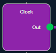

# 2024-2025 - Project 4 - Web FPGA - Team 4 - Technical Specifications

<summary> 

## Table of contents </summary>

- [2024-2025 - Project 4 - Web FPGA - Team 4 - Technical Specifications](#2024-2025---project-4---web-fpga---team-4---technical-specifications)
  - [Table of contents ](#table-of-contents-)
  - [Project Overview](#project-overview)
    - [Project Introduction](#project-introduction)
    - [Document Purpose](#document-purpose)
  - [Scope](#scope)
  - [Dependencies  ](#dependencies-)
    - [1. Git \& GitHub  ](#1-git--github-)
      - [Installation:](#installation)
    - [2. Node.js and npm](#2-nodejs-and-npm)
      - [Installation:](#installation-1)
    - [3.Project Dependencies](#3project-dependencies)
    - [4. Running the project](#4-running-the-project)
  - [Tasks](#tasks)
    - [Designing the web interface and the user interface](#designing-the-web-interface-and-the-user-interface)
    - [Parsing from SDF to JSON](#parsing-from-sdf-to-json)
    - [Coding the web interface and the user interface](#coding-the-web-interface-and-the-user-interface)
    - [Parsing from JSON to HTML](#parsing-from-json-to-html)
    - [Back-End development](#back-end-development)
    - [Animations](#animations)
    - [Documentation](#documentation)
    - [Testing, debugging, and reviewing](#testing-debugging-and-reviewing)
    - [Task handling](#task-handling)
    - [Task distribution](#task-distribution)
  - [Schedule](#schedule)
  - [System overview](#system-overview)
    - [System architecture](#system-architecture)
    - [Software architecture diagram](#software-architecture-diagram)
      - [Project structure](#project-structure)
        - [Front-end](#front-end)
        - [Back-end](#back-end)
          - [Back-end Workflow:](#back-end-workflow)
          - [Additional Back-end Files:](#additional-back-end-files)
  - [Software](#software)
    - [Front-end](#front-end-1)
      - [Web page](#web-page)
    - [Back-end](#back-end-1)
      - [Parser](#parser)
        - [Timescale](#timescale)
        - ["fpga\_interconnect"](#fpga_interconnect)
          - [JSON Counterpart:](#json-counterpart)
          - [Example on the webpage:](#example-on-the-webpage)
        - ["LUT\_K"](#lut_k)
          - [JSON counterpart:](#json-counterpart-1)
          - [Example on the webpage:](#example-on-the-webpage-1)
        - ["DFF"](#dff)
          - [JSON counterpart:](#json-counterpart-2)
          - [Example on the webpage:](#example-on-the-webpage-2)
        - ["IO"](#io)
          - [JSON counterpart:](#json-counterpart-3)
          - [Example on the webpage:](#example-on-the-webpage-3)
      - [Visualising the elements and signals](#visualising-the-elements-and-signals)
        - [Elements](#elements)
        - [Connections](#connections)
        - [Color codes](#color-codes)
      - [Tool-Bar buttons](#tool-bar-buttons)
    - [Animations  ](#animations-)
  - [Testing](#testing)
    - [Testing strategy](#testing-strategy)
  - [Risks and mitigation strategies](#risks-and-mitigation-strategies)
  - [Glossary](#glossary)

## Project Overview

### Project Introduction
This project was commissioned by the **CNES (Centre National d'Études Spatiales)<sup><a href="#1">[1]</a></sup>**. The objective is to develop a web page that assists teachers in **explaining how FPGAs (Field Programmable Gate Arrays)<sup><a href="#2">[2]</a></sup> function**. The web page will achieve this by **visualizing an example or simulation of the internal FPGA processes** when specific code is input.

The website will utilize information stored in **`.SDF` (Standard Delay Format)<sup><a href="#3">[3]</a></sup> files**. These files will be parsed and converted into a `.JSON` format.

Our primary audience is:

- **Teachers** who will use the tool to teach their students.
- **Students** who will interact with the simulator to discover FPGAs and help them understand FPGA behavior.

Since the primary goal is education, **user experience (UX) and user interface (UI) design will be the focus** as they are crucial to the project's success.

### Document Purpose
This document provides **detailed technical specifications for the development of the web page**, ensuring the correct implementation of the required features. These specifications will be based on the **functional specifications** [link](../functional-specifications/functional-specifications.md).

This tool is being developed at the CNES's request and will serve as an educational resource for teachers to explain the inner workings of FPGAs.

## Scope
The project is divided into two main parts:

1. **Front-end**: **The web-based interface that users will see and interact with**. This includes the visualization of the FPGA structure and signal propagation, as well as the user interface.
2. **Back-end**: The code that **handles file uploads**, translates the `.SDF` file into HTML code and injects it back onto the page.

The programming languages we will use for this project are as follows:

- **Front-end**: HTML, CSS, and JavaScript.
- **Back-end**: Node.js and JavaScript

## Dependencies  

This project requires several dependencies to function properly. Below is a list of the essential tools and libraries to set up and run the project.  

### 1. Git & GitHub  
The project is hosted on GitHub. Ensure you have Git installed to clone the repository and manage version control.  

#### Installation:
- Download and install Git from [git-scm.com](https://git-scm.com/) if not already installed.  
- Clone the repository using:  

```sh
git clone https://github.com/algosup/2024-2025-project-4-web-fpga-team-4.git
cd 2024-2025-project-4-web-fpga-team-4/src
```

### 2. Node.js and npm
The project requires Node.js and npm (Node Package Manager) to manage dependencies and run scripts.

#### Installation:
- Download and install Node.js from [nodejs.org](https://nodejs.org) (npm is included with Node.js).
- Verify installation:
```sh
node -v  # Check Node.js version  
npm -v   # Check the npm version  
```

### 3.Project Dependencies
After cloning the repository, install all required dependencies using npm:

```sh
npm install
```
This command reads the `package.json` file and installs all necessary packages.

### 4. Running the project
To start the project, use the following command:
```sh
npm start
```
This will launch the application in a development environment.

## Tasks

Here are the tasks we will need to accomplish to finish the project:

### Designing the web interface and the user interface
The first step is to **design the web interface and write graphical charters** to allow the development team to start working on the UI as soon as possible. **The mockups will be made using Figma** and are available [here](https://www.figma.com/design/A6rvzTJCZQQyznhdQbu753/FPGA-Web-App?node-id=0-1&m=dev&t=lkPKlLFY9KAmra26-1), and the graphical charter is available [here](../functional-specifications/graphical-charter.md)

### Parsing from SDF to JSON
While designing the web interface, **we need to create a data parser** to **convert the `.SDF` file from the teacher into a more readable `.JSON` format**. This step is optional, but it **lets the teacher write a `.JSON` file directly in our format**. This way, they won’t have to write code in Verilog<sup><a href="#4">[4]</a></sup> or VHDL<sup><a href="#5">[5]</a></sup> and convert it into an `.SDF` file every time they want to show different examples to their students.

### Coding the web interface and the user interface
After the designs have been decided on and mockups have been made, the coding team needs to start implementing them on the web page. **These will be made using HTML, CSS, and Javascript**.

### Parsing from JSON to HTML
Once we have the web interface, **we need to transform the JSON file** that contains the information from the `.SDF` file **into HTML code** that can be injected into the web page. 

### Back-End development
We don't only need HTML elements, **we need JavaScript and CSS code as well to make our web page responsive** and for animations. The back-end code will contain elements like **the toolbar** on the top of our page, which **controls the signal flow and the import button**, or the colors and placements of the FPGA elements. 

### Animations
After the elements show correctly **we need to add animations for electrical signals**, to show the time it takes for the electrical signal to go from one end of the cable to the other. The animations will be made **using CSS key-frames**.

### Documentation
While the web page is being made, **the rest of the team needs to work on the documentation**. They need to write **technical documentation, user guides test cases, and all other relevant documentation**.

### Testing, debugging, and reviewing
We need to test the system for **bugs, performance issues, and problems with the UI**. Testing will be done **throughout the whole project** to ensure the fixes are implemented as soon as possible. We will also need to **review the documentation** to check for **spelling mistakes, clarity issues, and relevance issues**.

### Task handling
The team will **collaboratively work on all tasks**, each member will **focus on the tasks assigned to their role** and will **help other members** if they have nothing to do.

### Task distribution

The tasks will be distributed among the team members as follows:

- **Designing the web interface and the user interface**: Maxime (PGM) and Clémentine (TW)
- **Parsing from JSON to HTML**: Laurent (SE), Jason (SE) and Emilien (TL)
- **Coding the web interface and the user interface**: Laurent (SE) and Jason (SE)
- **Parsing from JSON to HTML**: Laurent (SE), Jason (SE) and Emilien (TL)
- **Back-End development**: Laurent (SE), Jason (SE) and Guillaume (QA)
- **Animations**: Laurent (SE) and Jason (SE)
- **Documentation**: Maxime (PGM), Emilien (TL), Clémentine (TW), Thibaud (PM) and Guillaume (QA)
- **Testing, debugging, and reviewing**: Guillaume (QA) and Thibaud (PM)

By doing so, each team member **will work on multiple tasks**, ensuring that everyone has a well-rounded understanding of the project and can contribute effectively to its success.

The team will follow an **agile development<sup><a href="#7">[7]</a></sup> approach**, with **regular sprints, stand-up meetings, and retrospectives** to track progress, address issues, and make adjustments as needed. The team will also use **version control and issue-tracking tools** to manage the project and collaborate effectively.

## Schedule

The project will be developed over 6 weeks, with the following milestones:

1. **Week 1**: Project Kickoff, analysis of the requirements, understanding of the `.SDF` files, task distribution, and planning.
2. **Week 2**: Parsing, and sending our mockups and designs to the client for review and front-end development.
3. **Week 3**: User interface, Back-end development and integration
4. **Week 4**: Signal propagation integration.
5. **Week 5**: Testing and debugging.
6. **Week 6**: Final testing, deployment, and delivery

The documentation will also be worked on during these 6 weeks.

## System overview

### System architecture

Our GitHub repository will be created following the architecture hereunder:

```cmd
Root
│   .github
├───documents
|   |   01-documentation-report.yml
|   |   02-UI-changes-request.yml
|   |   03-server-bug-report.yml
|   |   04-client-bug-report.yml
│   pull-request-template.md
|
│   .gitignore
│   CODE_OF_CONDUCT.md
│   LICENSE
│   README.md
│
├───documents
│   ├───functional-specifications
│   │   │   mockups.pdf
│   │   │   functional-specifications.md
│   │   │
│   │   └───img
|   |       |
│   │       └───img
│   │
│   ├───management
│   │   │   management-artifacts.md
│   │   │   project-charter.md
│   │   │
│   │   ├───img
│   │   │
│   │   └───weekly-reports
│   │           cumulative.md
│   │           week1.md
│   │           week2.md
│   │           week3.md
│   │           week4.md
│   │           week5.md
│   │           week6.md
│   │
│   ├───quality-assurance
│   │       test-cases.md
│   │       test-plan.md
│   │
│   └───technical-specifications
│       │   technical-specifications.md
│       │   naming-conventions.md
|       |
│       └───images
│
└───src
 │   .gitignore
 |   .keep
 |   index.js
 |   package-lock.json
 |   package.json
 │
 ├───code
 |   ├───css
 |   |   animations.css
 |   |   data-display.css
 |   |   shematics.css
 |   |   tool-bar.css
 |   |
 |   ├───data
 |   |
 |   ├───img
 |   |   fpga-explorer.html
 |   |
 |   ├───js
 |   |   animations.js
 |   |   connections.js
 |   |   load.js
 |   |   parse-json-to-data.js
 |   |   parse-sdf-to-json.js
 |   |   schematics.js
 |   |   tool-bar.js
 |   |   variables.js
 |   404.html
 |   client.html    
 |
 └───test
```

### Software architecture diagram
Our software communicates following the diagram hereunder (if the diagram does not show fully, click the expand button).


#### Project structure

This project is structured into two main components: the **Front-end** and the **Back-end**.

##### Front-end

Several files will manage different aspects of the front-end:

- **`client.html`** – Serves as the main structure of the web page.
- **`tool-bar.css`** & **`data-display.css`** – Handle the interface styling.
- **`schematics.css`** – Defines the color and shape of the wires and FPGA elements.

When a user uploads an `.SDF` file, it will be sent to the **`sdf-to-json` parser** in the back-end for processing.

##### Back-end

The back-end will be **developed using JavaScript** and **tested with Node.js**. Its primary role is to **process the `.SDF` file** provided by the user and extract relevant information for display.

###### Back-end Workflow:
1. The uploaded `.SDF` file is sent to **`sdf-to-json-parser.js`**, which processes the file.
2. The parsed data is returned as a **`.JSON`** file, which will be explained in more detail in the parser section. It is processed as a variable and sent to the **`json-to-data-parser.js`**.
3. The **`json-to-data-parser.js`** file then calls these two files:
   - **`schematics.js`** – To display the FPGA elements.
   - **`connections.js`** – To draws wires between elements.

###### Additional Back-end Files:
- **`load.js`** – Manages client-side logic.
- **`tool-bar.js`** – Handles the toolbar buttons.

Finally, the back-end sends all processed information to **`client.html`**, which renders the web page in the user's browser.


## Software

This section will explain in detail the **role, goal, and structure of each important software element** for this project.

### Front-end

The front-end for this project is **the part we will focus on the most**. As the project is supposed to be used by teachers, for students, the user interface and displayed elements need to be **easy to use/read and responsive**.

#### Web page

The web page is the **main element of this project**, it's goal is first and foremost to show the **visualization of the FPGA structure** contained in the `.SDF` file. It should also provide an **intuitive and interactive user interface** for uploading Verilog applications and controlling signal propagation.
The webpage will consist of these components:
- **Main content**: The main content area where the FPGA structure visualization will be displayed. This will include the FPGA elements and wires.
- **Sidebar**: The sidebar area where clock signals will be displayed.
- **Header**: The header area with the project name and a button for uploading files. It will also contain the interactive components for controlling simulations such as arrows to move backward and forward in time.

### Back-end

The back-end will handle **file uploads, and signal propagation buttons and will send the necessary information to the Front-end**.  

The back-end consists of the **`sdf-to-json-parser.js`** file, which processes `.SDF` files and outputs **parsed data in `.JSON` format**.  

This `.JSON` file will then be used by **`json-to-data-parser.js`**, which interacts with:  
- **`schematics.js`** – Responsible for displaying FPGA elements.  
- **`connections.js`** – Used to draw the wires between FPGA elements.  
- **`tool-bar.js`** – Controls the buttons on the toolbar.  
- **`load.js`** – Manages client-side logic.  
- **`variables.js`** – Stores all necessary variables.  

#### Parser

The parser will be implemented in **JavaScript**. Its purpose is to **read the `.SDF` file** and extract relevant information about the structure of the FPGA project. This data will then be converted into a **`.JSON` file**, which can be easily used by the front-end.  
  
The `.JSON` files will be structured in a way that allows users to **manually create them from scratch**. This avoids the need to write **Verilog or VHDL code** each time they want to prepare a new example for their students.  

The parser will be able to handle:  
- **Basic types of FPGA cells**, such as **LUTs<sup><a href="#8">[8]</a></sup> and Flip-Flops<sup><a href="#9">[9]</a></sup>**.  
- **Delays** and **connections** between elements.  
 
Below, you will find **examples of different cell types** and their counterparts in the parsed `.JSON` file. Additionally, an example of how they will be displayed on the **web page** is provided.  

These examples are all taken from the [5FF.sdf](https://github.com/LeFl0w/ALGOSUP_POC/tree/main/Examples/5ffs_VTR) file, which was provided by the client.  


##### Timescale
```sdf
(TIMESCALE 1 ps)
```

This **defines the time unit**.

The main information we can extract from this element is:
- The time unit for delays: **`ps` so picoseconds in our case**.

> [!Note]
> This element will not have a counterpart in `.JSON` as the client said the time delay will always be in 1 ps, however, I mention it here in case we need to add it later.


##### "fpga_interconnect"

```sdf
 (CELL
 (CELLTYPE "fpga_interconnect")
 (INSTANCE routing_segment_D_output_0_0_to_lut_\$auto\$rtlil\.cc\:2714\:MuxGate\$175_input_0_3)
 (DELAY
 (ABSOLUTE
 (IOPATH datain dataout (235.697:235.697:235.697) (235.697:235.697:235.697))
 )
 )
 )
```

This element represents a **connection**.

The main information we can extract from these elements are:
- **The starting point:** `D_output_0_0`.
- **The end point:** `lut_\$auto\$rtlil\.cc\:2714\:MuxGate\$175_input_0_3`.
- **The propagation delay:** `235.697`.

> [!Note]
> The delay can be found on this line `(IOPATH datain dataout (235.697:235.697:235.697) (235.697:235.697:235.697))`, as you can see, there are six different values separated into two groups of three value.
> The first value is the minimum delay, the second value is the typical delay and the third value is the maximum delay. These are all the same for our example but they can vary in more complex systems. 
> However, for what we are trying to do, we were told to assume the values will always be the same, so we only care about the first one. This will be consistent for all examples where timing is mentioned.

###### JSON Counterpart:
```JSON
{
    "Input": {
      "type": "userInput",
      "id": "0",
      "io": "output",
      "port": "0"
},
  "Output": {
    "type": "lut",
    "id": "175",
    "io": "input",
    "port": "3"
},
    "Delay": 235.697
},
```

In this format:
- **`"Input"`** means this is where the **connection starts**.
- **`"Output"`** means this is where the **connection ends**.
- **`"type"`** is the **type of element**.
- **`"id"`** is a **number associated with the element** to help us recognize which one it is, for this element:
**`lut_\$auto\$rtlil\.cc\:2714\:MuxGate\$175_input_0_3`**, it's 175. If there is no specified ID, it will be set to 0.
- **`"io"`** is wether the cable comes out (**`"output"`**) or goes into (**`"input"`**) the element.
- **`"port"`** is which port the cable comes out or goes in, for this element: `lut_\$auto\$rtlil\.cc\:2714\:MuxGate\$175_input_0_3` it's 3.
- **`"Delay"`** is the time it takes for the signal to go from one end of the connection to the other.

###### Example on the webpage: 

 

This example corresponds to the connection used as an example.

##### "LUT_K"

```sdf
 (CELL
 (CELLTYPE "LUT_K")
 (INSTANCE lut_\$auto\$rtlil\.cc\:2714\:MuxGate\$175)
 (DELAY
 (ABSOLUTE
 (IOPATH in[1] out (152:152:152) (152:152:152))
 (IOPATH in[3] out (150:150:150) (150:150:150))
 (IOPATH in[4] out (118:118:118) (118:118:118))
 )
 )
 )
```

This element defines an **instance of a LUT(Look Up Table) and its ports** that will be used by the FPGA. 

The main information we can extract from these elements are:
- **the name and id of the LUT**: name:`lut_\$auto\$rtlil\.cc\:2714\:MuxGate\$175` id: `$175`.
- **the ports that are used**: `IOPATH in[1]`, `IOPATH in[3]`, `IOPATH in[4]`.
- **the time it takes for the signal to go from the input to the output of the LUT**: `152` for this line: (IOPATH in[1] out (152:152:152) (152:152:152)).

###### JSON counterpart:
```JSON
 {
      "id": 175,
      "connections": [
 {
          "io": "input",
          "port": "3"
 },
 {
          "io": "input",
          "port": "4"
 },
 {
          "io": "input",
          "port": "1"
 },
 {
          "io": "output",
          "port": "0"
 }
 ]
 },
```

In this format:
- **`"id"`** is a **number associated with the element** to help us recognize which one it is, for this element: 
`(INSTANCE lut_\$auto\$rtlil\.cc\:2714\:MuxGate\$175)`, it's 175. If there is no specified ID, it will be set to 0.
- **`"io"`** is whether the port is an input (`"input"`) or an output (`"output"`) of the LUT.
- **`"port"`** is the number associated with the port, for this element: 
         `(IOPATH in[1] out (152:152:152) (152:152:152))`
         `(IOPATH in[3] out (150:150:150) (150:150:150))`
         `(IOPATH in[4] out (118:118:118) (118:118:118))`
the port will use the numbers 1, 3, and 4. 

###### Example on the webpage: 

 

This example corresponds to the LUT used as an example.
  
##### "DFF"

```sdf
 (CELL
 (CELLTYPE "DFF")
 (INSTANCE latch_\$sdff\~2\^Q\~0)
 (DELAY
 (ABSOLUTE
 (IOPATH (posedge clock) Q (303:303:303) (303:303:303))
 )
 )
 (TIMINGCHECK
 (SETUP D (posedge clock) (-46:-46:-46))
 )
 )
```

This element defines an **instance of a Delay Flip Flop (DFF) and its ports** that will be used by the FPGA. 

The main information we can extract from these elements are:
- **the name and id of the DFF**: name:`latch_\$sdff\~2\^Q\~0` id: `2`.
- **the propagation delay**: `(IOPATH (posedge clock) Q (303:303:303) (303:303:303))`. Here it's 303.
- **The setup time constraint**: this corresponds to the time `(SETUP D (posedge clock) (-46:-46:-46))` here it's -46 so 46 picoseconds before.

###### JSON counterpart:
```JSON
 {
      "id": 2,
      "connections": [
 {
          "port": "clock"
 },
 {
          "port": "input"
 },
 {
          "port": "output"
 }
 ]
 },
```

In this format:
- **`"id"`** is a **number associated with the element** to help us recognize which one it is, for this element: 
`latch_\$sdff\~2\^Q\~0`, it's 2. If there is no specified ID, it will be set to 0.
- **`"port"`** is the name associated with the port for this element. 

> [!Note]
> The ports are numbers for the LUTs because they are defined as such, here they are names as there will always be the three same ports, thus making it easier to read.

###### Example on the webpage: 

 

This example corresponds to the DFF used as an example.

##### "IO"

These elements are **not defined in the `.SDF` file**. However, the client told us **they would always exist** and would **always be the same**. Therefore we **defined them ourselves as they are important and need to be displayed for teaching purposes**.

###### JSON counterpart:
```JSON
"IOs": [
 {
      "name": "userInput",
      "io": "output"
 },
 {
      "name": "Async_reset",
      "io": "output"
 },
 {
      "name": "Clock",
      "io": "output"
 },
 {
      "name": "userOutput",
      "io": "input"
 }
 ],
```

In this format:
- **`"name"`** is the **name of the element**.
- **`"io"`** is whether the port takes in an input (`"input"`) or outputs (`"output"`).

###### Example on the webpage: 





#### Visualising the elements and signals

After parsing the `.JSON` file, the back-end needs to process the data before sending it back to the front-end to visualize it.

The visualization will be made **using simple shapes for the elements and lines for the wires**. The team will focus on making the visualization **clear and easy to understand** before adding extra functionalities as the goal of this project is to teach students.

The elements and signals will go **from left to right** as it is supposed to be used by a French organization and European countries read from left to right. The page will be separated into four columns:

##### Elements

The elements will be created as **`<div>` HTML elements**. This element will contain **one `<div>` and a `<paragraph>` for each input or output socket** and **another `<parapraph>` that will contain its name**.

Here is a code example of how a LUT would be made.
```HTML
<div class="lut-element" id="lut175">
 <div>
  <p class="lut-id ">LUT 175</p>
  <div class="lut-in-before used" id="lut-175-in1"></div>
  <p class="lut-in">1</p>
  <div class="lut-in-before used" id="lut-175-in3"></div>
  <p class="lut-in">3</p>
  <div class="lut-in-before used" id="lut-175-in4"></div>
  <p class="lut-in">4</p><p class="lut-out used">0</p>
  <div class="lut-out-after used" id="lut-175-out"></div>
 </div>
</div>
```

There will be four different columns containing the elements:

- **Input**:
 This will be the **leftmost column** and will contain in this order from top to bottom: **Async_Reset, userInput, and clock**. The clock will be a fixed HTML element at the bottom of the screen in accordance with the request of our program manager. 

- **LUT**:
 This column will be the **second leftmost column**. It will contain all the **LUTs**.

- **Flip-Flop**:
 This column will be the **second rightmost** column. It will contain all the **Flip-Flops**.

- **Output**:
 This will be in the **rightmost column** and will contain the **user output**.

All elements will be designed as so:


The **green circles represent inputs** and the **red circles represent outputs**. There will be **id's or text as needed to represent each input or output**. The text will be on the right of the inputs and the left for the outputs.

> [!Note]
> The colors are not the colors we will use, they will be defined in the [Color Codes](#color-codes) section

##### Connections

The connections will be created using **`<div>` HTML elements** as using things like SVG paths makes them immobile which causes issues.

```HTML
<div class="line used userInput-out" style="height: 0.6vh; width: 2.7400406504065034vw; margin-top: 36.69547786177106vh; margin-left: 10.661204268292684vw; background-color:var(--d-color); position: undefined; z-index: 0"></div>
```
It will mostly be defined by its `style` parameters as such:

- **height and width**:
 These define, as their name implies, the height and width of the cable.

- **margin-top and margin-left**:
 As the wires are children of the main elements, they are placed using margins, so these elements place the cable correctly.

- **background-color**:
 This defines the cable's color.

- **position**:
 This defines the position of the cable. It will only be used for wires with special properties like the clock cable which is in a fixed position at the bottom of the screen.

- **z-index**:
 This element controls the z-index of the wires. It will also only be used for wires with special properties like the clock cable.
  
The wires will be straight lines connecting one element to the other.

##### Color codes

Each element will be assigned a different color to help differentiate between them:

| Element          | Default Color | Hexadecimal |
| ---------------- | ------------- | ----------- |
| **Async_reset** | Gray          | #7D7D7DFF |
| **UserInput** | Yellow        | #C29000FF |
| **Clock** | Purple        | #8E24AAFF |
| **LUT** | Green         | #009688FF |
| **DFF** | Red           | #D32F2FFF |
| **UserOutput** | Blue          | #007ACCFF |

The cable will be the same color as the element with the output to which it is connected.

When an electrical signal is sent, a circle which will be the opposite color of the background (black if the background is white and vice-versa), will follow the cable to show where the electrical signal is currently.

#### Tool-Bar buttons

The tool-bar contains different buttons which are all defined in the Back-end, here are all the buttons and their functions.

- **File Management**:
  - `Import`:
 
    - **Functionality:**: Allows users to upload an `.SDF` or `.JSON` file, which will then be displayed on the web page.  
    - **Implementation:** 
      - Use an `<input type="file">` element to let users select a file.  
      - Implement a JavaScript event listener to handle file selection. 
      - If the file is an `.SDF`, process it through the parser to convert it into `.JSON`.
      - If the file is a `.JSON`, directly display its contents.  

  - `Download`:
 
  - **Functionality**: Allows users to download the `.JSON` file generated from an imported `.SDF` file.
  - **Implementation:**
    - Convert the parsed JSON data into a downloadable `.JSON` file.
    - Create a temporary `<a>` element and trigger a download when the user clicks the download button.

- **Control**:
  - `pause/play`: 
 
 
    - **Functionality**: Pauses/resumes the movement of the electrical signal.
    - **Implementation**:   
      - Use a boolean variable to track whether the animation is running
      - Toggle the state when the button is clicked.
  - `previous/next/first/last`: 
 
 
 
 
    - **Functionality:** Moves to the previous/next/first/last frame of the animation.
    - **Implementation:**
      - Store animation frames in an array. 
      - Navigate through the frames based on button clicks.
  

- **Speed Controls**:
  - `speedPlus/speedMinus`
 
 
    - **Functionality:**: Controls the playback speed of the animation.
    - **Implementation:**: 
      - Adjust the animation interval dynamically. 
  - `speed`
 
    - **Functionality:** Displays the current speed setting.
    - **Implementation:** 
      - Get the animation interval level.
      - Display it.
- **Zoom Controls**:
  - `zoomIn/zoomOut`
 
 
    - **Functionality:** Controls the zoom level of the visualization.
    - **Implementation**
    - Modify the `transform: scale()` property of the display area.
  - `zoomLevel` 
 
    - **Functionality:** Displays the current zoom level.
    - **Implementation**
      - Get the `scale()` value.
      - Display it.

- **Display Controls**:
  - `hideButton/dataViewTrigger`
 
 
    - **Functionality:** Shows/hides the sidebar.
    - **Implementation:**
      - Use `classList.toggle()` to show or hide the sidebar.
  - `theme`
 
    - **Functionality:** Switches between light and dark themes.
    - **Implementation:** 
      - Use `classList.toggle()` to switch themes:
  - `settings`
 
    - **Functionality:** Currently unused but reserved for future configurations
    - **Implementation:** 
      - Can be linked to a settings modal.

### Animations  

The final part of the project involves animations.  

We will use the connection from *userInput* to *LUT 175* as an example:  

  

As explained in the [Connections](#connections) section, each segment of a wire is assigned a unique ID, as shown below:  

  

Since we have a function that sorts connections in the order in which the signal travels, we can use basic CSS animations to visually represent this flow. A white or black ball, which will be a `<div>` HTML element, will move along the wire, starting at the segment with ID 1:  

  

The ball will then continue along the next segments in sequence, such as IDs 2 and 3:  

  
  

Once the ball reaches the end of the last wire, it will disappear, and a new one will be generated for the next connection. The ball’s color will also change dynamically to match the selected theme.  

## Testing

The testing part of the project will be done using the following tools:

|Name|Description|Strengths|
|---|---|---|
|[Render](https://render.com)|Render is a tool that allows you to see the result of your code in [real time](https://two024-2025-project-4-web-fpga-team-4.onrender.com/client.html).|Each time the code is pushed on Github, the website will be automatically updated.|
|[Figma](https://www.figma.com/)|Figma is a tool that allows creating [designs and prototypes](https://www.figma.com/design/A6rvzTJCZQQyznhdQbu753/FPGA-Web-App?node-id=0-1&t=d8dCzS37lNdcWJEG-1).|It will be used as a reference to create the current website.|
|[Selenium](https://www.selenium.dev)|Selenium is a tool that allows to automate the tests. It will be used to test the code in different environments.|Provides multiple browsers to apply the test on (Safari, Edge, Firefox, Chrome).|
|[Github Actions](https://github.com/features/actions)|Github Actions is a tool that allows automating the tests.|Will be used to execute code, like reload render service and test directly on it.|

### Testing strategy

The strategies for testing will include the following:

- **Hybrid Test Strategy**
 A hybrid test strategy will be employed, combining both manual and automated testing. This ensures comprehensive coverage and early detection of issues for all parts of the project, including HTML, CSS, JavaScript, and the parser.

- **Test Case Design**
 Test cases will be designed based on the requirements and specifications provided. Each test case will include the test steps, expected results, and actual results.

- **Test Data Management**
 Test data will be created and managed to ensure that all possible scenarios are covered. This includes both positive and negative test cases.

- **Test Automation**
 Automation tools like Selenium and GitHub Actions will be used to automate repetitive test cases, ensuring faster and more reliable test execution.

- **Continuous Integration**
 Continuous integration practices will be followed to ensure that code changes are automatically tested and integrated into the main branch.

- **Defect Management**
 Defects found during testing will be logged, tracked, and managed using a defect-tracking tool. Each defect will be assigned a priority and severity level.

## Risks and mitigation strategies

As with any project, this project will face issues during development, including **technical issues, wrong interpretation of the `.SDF` files, and deadline issues**. These risks need to be mitigated to **minimize the impact of unforeseen challenges** and ensure the **successful completion of the project**. To mitigate these risks, the team has identified the following strategies:

1. **Technical issues**: The team may encounter difficulties when **visualising and simulating signals and elements and linking the front-end and back-end code**. To mitigate these risks, the team will **leverage online resources and our lessons**.
2. **Wrong interpretation of the `.SDF` files**: The team may **misinterpret the information contained in the `.SDF` files**. To mitigate these risks, the team will **collaborate with the customer, and conduct thorough research**.
3. **Deadline issues**: The project may drag on and experience delays due to unforeseen circumstances, such as technical setbacks and scope changes. To mitigate these risks, the team will **maintain regular communication, track progress, and adjust the project plan** as needed to ensure timely delivery.

## Glossary

|Terms|Definitions|Links|
|-----|-----------|-----|
|<a id="1">[1]</a> CNES|Centre national d'études spatiales (CNES) is the French national space agency. Headquartered in central Paris, the agency comes under the supervision of the ministries of the Armed Forces, Economy and Finance and Higher Education, Research and Innovation.|[Wikipedia](https://en.wikipedia.org/wiki/CNES)|
|<a id="2">[2]</a> FPGA|A field-programmable gate array (FPGA) is a type of configurable integrated circuit that can be repeatedly programmed after manufacturing.|[Wikipedia](https://en.wikipedia.org/wiki/Field-programmable_gate_array)|
|<a id="3">[3]</a> SDF|Standard delay format (FPGA) is a standard for the representation and interpretation of timing data for use at any stage of an electronic design process.|[Wikipedia](https://en.wikipedia.org/wiki/Standard_Delay_Format)|
|<a id="4">[4]</a> Verilog|Verilog is a hardware description language (HDL)<sup><a href="#6">[6]</a></sup> used to model electronic systems.|[Wikipedia](https://en.wikipedia.org/wiki/Verilog)|
|<a id="5">[5]</a> VHDL|VHDL (VHSIC Hardware Description Language) is a hardware description language that can model the behavior and structure of digital systems at multiple levels of abstraction, ranging from the system level down to that of logic gates, for design entry, documentation, and verification purposes.|[Wikipedia](https://en.wikipedia.org/wiki/VHDL)|
|<a id="6">[6]</a> HDL|In computer engineering, a hardware description language (HDL) is a specialized computer language used to describe the structure and behavior of electronic circuits, usually to program field-programmable gate arrays (FPGAs).|[Wikipedia](https://en.wikipedia.org/wiki/Hardware_description_language)|
|<a id="7">[7]</a> Agile Development|Agile software development is an umbrella term for approaches to developing software it focuses on: Individuals and interactions over processes and tools, working software over comprehensive documentation, customer collaboration over contract negotiation, responding to change over following a plan.|[Wikipedia](https://en.wikipedia.org/wiki/Agile_software_development)|
|<a id="8">[8]</a> LUT|A lookup table (LUT) is a digital circuit that can be used to implement any Boolean function in FPGA design|[hardwarebee](https://hardwarebee.com/overview-of-lookup-tables-in-fpga-design)|
|<a id="9">[9]</a> Flip-Flop|Flip-flops are the main component in an FPGA that is used to keep the state inside of the chip.|[Nandland](https://nandland.com/lesson-5-what-is-a-flip-flop)|